# Atlas Platform Specification

**Version:** 3.2
**Status:** Draft

---

## 1. Vision

Atlas is a compile-time composed, server-authoritative platform for building real-time interactive applications.

Atlas provides:

- a deterministic runtime
- compile-time capability composition
- generated contracts
- reflection
- serialization
- scheduling
- replication
- resource identity
- automation tooling

Atlas intentionally avoids defining application semantics.

- Applications define meaning.
- Capabilities define behavior.
- Atlas defines execution.

Every Atlas application is built from the same architectural model.

---

## 2. Core Principles

### Stable Runtime

The runtime remains small and stable.

New functionality is added through capabilities rather than runtime expansion. The runtime provides foundational execution mechanisms while remaining independent from application-specific behavior.

### Compile-Time Composition

Capabilities are composed during compilation.

- The runtime executes a validated application graph.
- The runtime never discovers capabilities dynamically.
- Composition decisions are made before execution begins.

This allows Atlas to provide:

- predictable dependencies
- deterministic behavior
- generated contracts
- optimized builds
- fast iteration

### Reflection First

Public contracts are reflected. Reflection powers:

- networking
- serialization
- editors
- automation
- documentation
- AI tooling
- debugging

Reflection metadata is generated during the build. Reflection is treated as a foundational system rather than an optional feature.

### Mechanism Over Meaning

Atlas understands execution. Applications define semantics.

| The runtime understands | The runtime never understands |
|---|---|
| entities | players |
| properties | health |
| requests | weapons |
| events | inventories |
| stages | quests |
| jobs | game rules |
| resources | |
| scheduling | |

Those right-hand concepts belong to capabilities. Atlas provides mechanisms through which applications express meaning.

---

## 3. Architectural Definitions

### Platform

Atlas is the complete platform. The platform consists of:

- compile-time tooling
- runtime libraries
- generated contracts
- reflection metadata
- capability libraries
- hosts

Atlas Platform defines the architecture used by all Atlas applications.

### Runtime

The Atlas Runtime is the execution environment shared by every host. It provides deterministic execution, scheduling, serialization, replication, resource management, and other reusable infrastructure.

- The runtime contains no application-specific behavior.
- The runtime is intentionally stable.
- New application behavior is introduced through capabilities rather than runtime modification.

### Tooling

Atlas Tooling performs compile-time analysis and generation, executing during the build process. Atlas tooling:

- validates capability definitions
- validates dependency graphs
- validates contracts
- validates stage ordering
- validates request signatures
- validates serialization schemas
- generates contracts
- generates reflection metadata
- generates documentation
- processes resources

Tooling produces artifacts consumed by runtime systems.

### Host

A host is a logical execution context produced by composing:

- runtime libraries
- generated contracts
- capability libraries
- application code

A host defines an execution environment with its own:

- scheduling
- authority model
- composed capabilities
- runtime state

A host is an architectural concept rather than an operating system process. Examples include:

- dedicated server
- gameplay client
- editor
- automated test runner
- command-line utility

All hosts share the same execution model.

### Capability

A capability is a compile-time composable unit of behavior. A capability may define:

- entities
- properties
- requests
- events
- resources
- systems
- stages
- jobs
- editor extensions

- Capabilities expose public contracts.
- Capabilities may depend only on lower-level capabilities.
- Capabilities do not modify the runtime.

### Contract

A contract is the generated public interface through which capabilities and hosts communicate. Contracts describe public structure rather than implementation. Contracts may include:

- identifiers
- property definitions
- request definitions
- event definitions
- serialization metadata
- reflection metadata
- documentation metadata

Contracts contain no application algorithms. Generated code implements structure, not behavior.

### Resource

A resource is an externally authored asset identified by a stable resource identity.

- Resources are resolved through generated metadata rather than hard-coded paths.
- Resources remain independent from application logic.
- Resource resolution is always scoped to the requesting host's composition. A host only ever resolves resource IDs referenced by the capabilities it composes — a server host composing no UI capabilities never encounters UI resource IDs (icons, textures, fonts), because the capabilities that reference them are never part of its composition. `atlas-resource` is the same library on every host; it simply gets asked for different things by different capability compositions.

Examples include:

- models
- textures
- materials
- configurations
- serialized data
- authored assets

---

## 4. Architectural Invariants

Every Atlas application follows the same architectural rules. These rules define the boundaries of the platform.

### Runtime Independence

The runtime never depends on capabilities. The runtime provides mechanisms but never knows application semantics.

### Capability Isolation

- Capabilities never depend on applications.
- Applications compose capabilities.
- Capabilities remain reusable across different applications and hosts.

### Compile-Time Composition

All capability composition occurs during compilation. Runtime discovery of capabilities is not part of the Atlas architecture.

### Generated Contract Ownership

Generated code depends only on public contracts. Generated artifacts do not contain application logic.

### Shared Execution Model

All hosts execute the same runtime model. A server, client, editor, or automation tool differs only through composition.

### Reflection Consistency

Public structures are represented through generated reflection metadata. Reflection data is generated rather than manually maintained.

### Deterministic Execution

Atlas guarantees **bit-exact determinism**. Given identical inputs, a host produces identical outputs, down to the bit, on every execution.

This guarantee holds:

- across repeated runs on the same machine
- across different machines of the same target platform
- across a full session replay from a recorded input stream

Bit-exact determinism is required to support:

- lockstep networking
- authoritative replay
- rollback and resimulation

Sources of non-determinism are architectural defects, not acceptable variance. Atlas tooling and runtime libraries are responsible for eliminating common sources of non-determinism, including:

- unordered iteration over concurrent or parallel work
- floating-point operations that vary by platform or instruction set
- uninitialized memory
- wall-clock time or other non-reproducible external input used directly in simulation logic

Anything that must vary by platform (rendering, audio, non-simulation timing) is explicitly excluded from the deterministic boundary and must not influence simulation state.

Scheduling and execution order are controlled by Atlas systems rather than accidental implementation details. A fixed, reproducible stage and job order is part of the determinism guarantee, not merely an optimization.

#### Built-in Deterministic Types: Random and Time

Capabilities that require randomness or time must source it from runtime-provided, built-in deterministic types rather than platform or language facilities.

**Random**

Atlas provides a built-in deterministic random type. It is seeded explicitly, produces an identical sequence of values for a given seed on every platform, and is the only permitted source of randomness within simulation logic.

Capabilities must not read from platform entropy sources (OS random number generators, hardware RNG, uninitialized memory, or similar) directly. Doing so is a violation of the determinism guarantee.

**Time**

Atlas provides a built-in deterministic time type representing simulation time. Simulation time advances only through the runtime's scheduling and stage execution, never by reading wall-clock time directly.

Capabilities must not read platform wall-clock time (OS clock, high resolution timers, or similar) within simulation logic. Presentation-only concerns (e.g. audio, rendering interpolation) may use wall-clock time, but that time must not feed back into simulation state.

**Replay and Reproducibility**

Because random and time are both built-in, runtime-owned types rather than ambient platform state, a recorded input stream together with an initial random seed is sufficient to reproduce a session bit-exactly. Nothing outside the recorded inputs and the seeded random stream can influence simulation outcome.

The random stream is scoped **per host**: a single seeded stream is shared by every capability composed into that host, consumed in the same fixed order the deterministic scheduler already guarantees.

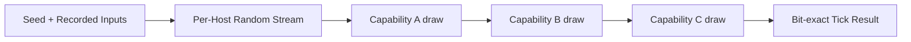

A replay is only valid against the host composition it was recorded with. This follows directly from determinism, not as a separate rule: changing which capabilities are composed into a host changes what that host's tick does, the same way replacing a physics engine would. Reproducibility guarantees identical output for identical composition and identical input — it does not guarantee identical output across a changed composition.

---

## 5. Dependency Model

Atlas dependencies always point toward lower architectural layers. No layer may depend upward.

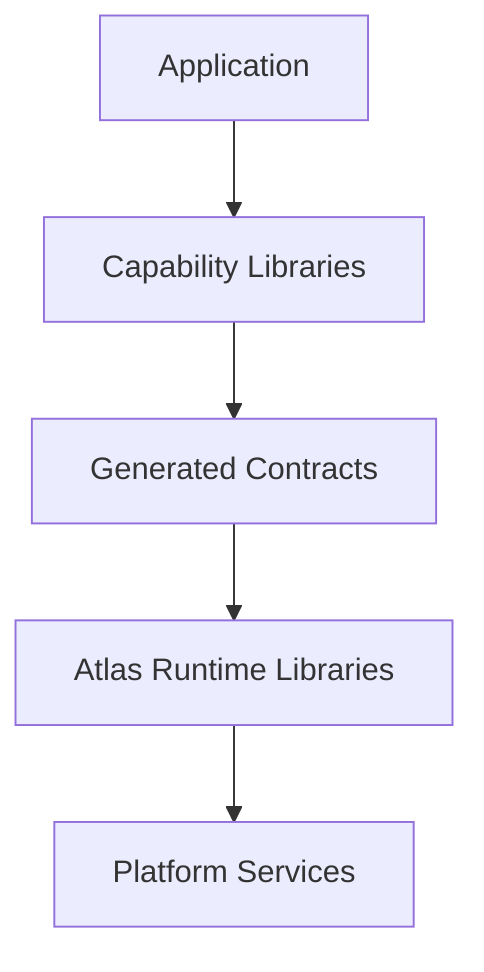

This dependency model minimizes coupling while maximizing reuse.

### Dependency Rules

The following rules define valid dependencies:

**Applications** may depend on:
- capabilities
- generated contracts
- runtime libraries
- platform services

Applications define final composition.

**Capabilities** may depend on:
- lower-level capabilities
- generated contracts
- runtime libraries

Capabilities may **not** depend on:
- applications
- editor implementations
- deployment-specific code

**Runtime libraries** may depend on:
- lower-level runtime libraries
- platform services

Runtime libraries may **not** depend on:
- capabilities
- applications
- editor features

**Generated artifacts** may depend only on:
- public contracts
- schema definitions
- metadata generators

Generated artifacts do not contain:
- application behavior
- runtime implementation
- deployment logic

### Capability Dependency Ordering

Capability ordering is derived entirely from the dependency graph. There is no separate tier, layer number, or category assigned to a capability.

A capability declares the capabilities it depends on. Atlas tooling constructs a directed graph from these declarations. A capability is "lower-level" than another purely because the other depends on it, directly or transitively.

This graph is the sole source of ordering truth. No naming convention, folder location, or manual tier assignment participates in validation.

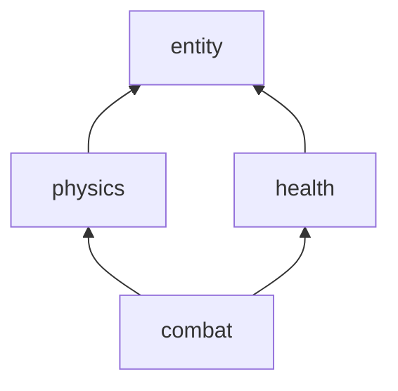

*Combat depends on health and physics; health and physics both depend on entity. Ordering is read bottom-to-top from the graph alone.*

#### Cycle Detection

A dependency cycle is an invalid composition.

If capability A depends, directly or transitively, on capability B, and B also depends, directly or transitively, on A, Atlas tooling fails the build.

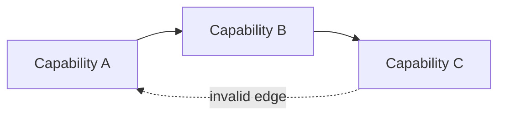

*A → B → C → A forms a cycle. This composition fails to build.*

The build failure is a hard compile-time error. Atlas tooling reports the full dependency chain that forms the cycle, in order, so the offending edge can be identified without manual graph tracing. For the example above, the tooling output identifies all three edges in the chain, not just the first offending dependency encountered.

This is consistent with the existing invariant that composition decisions, including validation of the dependency graph, occur entirely at compile time. Runtime discovery or runtime resolution of capability order is not part of the Atlas architecture.

### Tiny Interface Composability

Capabilities compose through small, single-purpose contracts rather than large, monolithic ones. A capability satisfies the specific contracts relevant to it; it does not inherit or implement a broad interface it only partially needs.

This mirrors structural interface composition found in languages like Go: a type there doesn't declare "I implement interface X" — it simply has the right methods, and satisfies any interface that asks for them. Atlas applies the same idea to properties and resources, at compile time, with zero runtime cost.

**Properties.** A property contract describes one narrow piece of structure — not "this is an Entity," but "this has a `Health`," or "this has a `Position`." A capability that only needs to read an entity's `Position` depends on a `HasPosition`-shaped contract, not on the entity's full property set. Two unrelated capabilities can each compose against the same small property contract without depending on each other, or on anything else the entity happens to carry.

**Resources.** The same principle applies to resources (§3, Resource). A capability that needs to load a texture depends on a `Loadable<Texture>`-shaped resource contract, not on the full resource system or on how a specific resource type is authored, versioned, or resolved. A resource that satisfies several small contracts (loadable, hot-reloadable, streamable) does so independently for each — a capability using it only for loading has no dependency on streaming.

**Location independence.** Where a property or resource is actually stored, executed, or resolved — locally, replicated from a server, resolved from disk, streamed — is a runtime and host concern (§6, §7), not a contract concern. The same tiny contract is satisfied whether the underlying implementation executes on a server host, a client host, or in a standalone test harness. A capability written against `HasPosition` does not change based on whether `Position` happens to be authoritative on this host or replicated onto it. This is the same principle §21 (Worked Example) already demonstrates for request-handling logic — identical capability logic, different host, different execution context — generalized to properties and resources as well.

**Compile-time, zero-cost satisfaction.** Contract satisfaction is resolved entirely at compile time. A capability's tiny contracts, and the metadata describing them, are built as `constexpr` data — not generated as a runtime-inspected schema that is merely produced by the build. This means:

- whether a given entity or resource satisfies a contract is a compile-time fact, checked the same way a C++ concept constraint is checked
- there is no runtime interface table, no virtual dispatch, and no runtime lookup cost for determining whether a contract is satisfied
- invalid composition (a capability depending on a contract nothing provides) is a compile error, consistent with §4 (Compile-Time Composition) and §12 (Compile-Time Validation), not a runtime failure

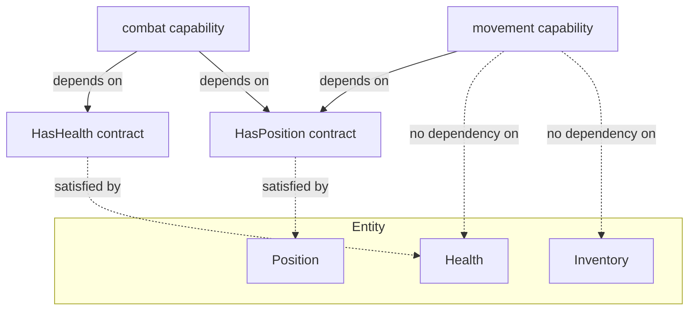

*`movement` depends only on `HasPosition`. It has no dependency on `Health` or `Inventory`, even though all three properties may exist on the same entity. `combat` composes two small contracts rather than depending on the whole entity.*

This keeps capabilities reusable in the way §4 (Capability Isolation) already requires, but extends the principle from "capabilities don't depend on applications" down to "capabilities don't depend on more structure than they actually use." A capability's dependency footprint reflects exactly the properties and resources it touches — nothing more.

### Ordering Without Stages

Execution order between capabilities is determined entirely by the dependency graph described above. There is no separate stage, phase, or system-registration concept through which a capability declares *when* it runs, alongside or instead of *what it depends on*.

This includes ordering concerns that might otherwise look like they need a distinct "phase" mechanism — most notably, the requirement that presentation output (rendering, audio) is derived only from simulation state that has already reached its final value for the tick (§4, Deterministic Execution). This does not require a capability, or a renderer, to register into a phase. It falls out of ordinary dependency:

- A presentation-only property (§20, Command Validation and Presentation-Only Properties) is contributed to only as the consequence of an already-validated request, by the capability handling that request.
- A renderer or audio system depends — in the ordinary §5 sense — on the presentation-property contracts it reads (`CurrentAnimation`, `ParticleEffects`, `ActiveAudioSources`), not on every gameplay capability that might contribute to them.
- Because the contributing capabilities are, transitively, lower in the dependency graph than the presentation properties they populate, and the renderer depends on those properties, the graph alone places the renderer after every contribution has been made for the tick — with no additional ordering concept required.

The runtime still executes in a fixed, deterministic sequence internally (§4, Deterministic Execution; `atlas-stage`, §13, Library Responsibilities) — determinism does not depend on capabilities being aware of that sequence or declaring themselves into it. A capability's only ordering input is what it depends on.

### Input as Intent

Raw platform input (key presses, mouse buttons, controller axes) never crosses into capability code. `atlas-input` (§13, Library Responsibilities) reads raw device state once per tick, resolves it against the current binding configuration, and produces `Intent` events — semantic, player-authored actions (`CastAbility`, `Interact`, `MoveForward`) — into the same batch/stage pipeline every other event uses.

```yaml
# atlas-input produces (game-declared intent vocabulary, not a fixed platform list):
events:
  Intent:
    kind: IntentId         # e.g. Interact, MoveForward, PrimaryAction
    entity: EntityRef
    axis: optional<Vec2>   # for continuous intents (movement direction, camera)
```

Binding configuration is data, not code — which key maps to which intent is authored as a binding config file, player-editable at runtime (no recompile, live rebind). A capability author never has access to "was E pressed" — only "did the player express this intent."

The `Intent` event from a player pressing a key and the `Intent` event from a Lua addon's valid macro (§19, Request Boundary) are the same type, produced by the same pipeline. The capabilities consuming them cannot and need not distinguish their origin.

`atlas-input` sits below any capability that needs player intention in the dependency graph — a movement capability depends on `atlas-input`, not on any platform-specific input concept. Because the dependency graph determines ordering (§5, Ordering Without Stages), input processing is guaranteed to precede the simulation systems that consume it, without any explicit stage declaration.

---

## 6. Server Authority

Atlas is server authoritative.

- Authoritative simulation executes on server hosts.
- Client hosts observe replicated state and issue requests.
- Replication distributes observable state from authoritative hosts.
- Authority is a responsibility of hosts rather than capabilities.

Capabilities remain independent of deployment topology and may execute within:

- server hosts
- client hosts
- editor hosts
- testing hosts
- other host compositions

without modification.

> A capability defines behavior. A host defines authority.

### Terminology: Request vs. Internal Dispatch

Atlas has one dispatchable contract kind: the **request** (§14, declared under a capability's `requests:` block, generated as a `RequestContract`). "Command" is not a separate schema concept — it describes a specific *origin*, not a different technical mechanism.

- A request **issued by a client** originates at the boundary between a client host and an authoritative host, crosses that boundary, is subject to validation and rejection (below), and may be predicted and reconciled (§6, Request Validation and Reconciliation).
- A request **dispatched internally** — one capability calling into another capability's request contract as part of handling its own work — never crosses the client/server boundary and was never issued by a client. This document calls such an internal dispatch a **command** as a matter of description, to keep prose about "what a capability does with an already-validated request" readable — but it is the same `RequestContract` mechanism, invoked from within a handler rather than from across the network.

An internal command is not itself subject to Request Validation — it inherits whatever validation the client-issued request that triggered it already passed. A client-issued request commonly results in one or more internal commands once it is accepted — but the request is the thing a client sent and a server decided on; the internal commands are how the server's own capabilities then carry that decision out, using the same dispatch mechanism, just invoked from code rather than from across the network.

### Request Validation and Reconciliation

Clients issue requests. A request is not a guaranteed state change — it is honored only if the server validates it.

The server validates every incoming request against authoritative state before applying it. If a request is invalid — because it conflicts with current authoritative state, fails a capability-defined precondition, or is not permitted for the issuing client — the server rejects the request. The server never silently mutates a client's request to make it valid.

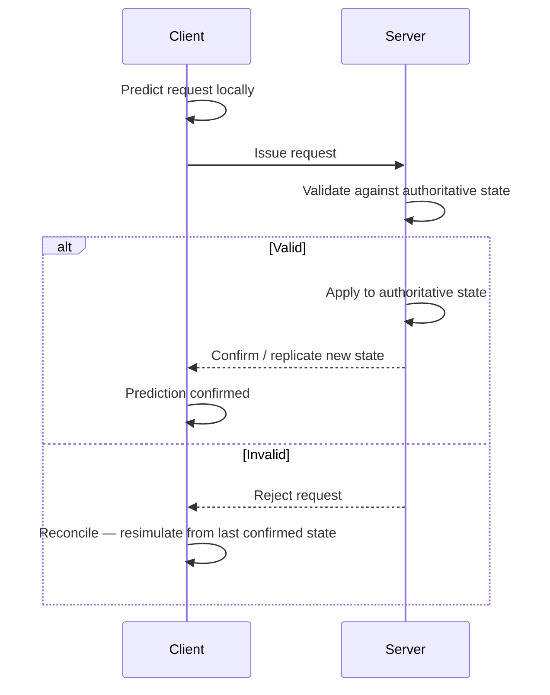

A rejected request is not applied to authoritative state. The server communicates rejection back to the originating client through the normal contract boundary (requests, events, or replicated state, as appropriate to the capability).

The client is responsible for reconciliation. Because Atlas guarantees bit-exact determinism, a client capability may predict the outcome of a request locally before server confirmation, then reconcile by resimulating from the last confirmed authoritative state if the server's outcome differs from the local prediction.

Reconciliation is a **capability** concern, not a runtime concern. The runtime provides the deterministic execution and replay mechanisms that make reconciliation possible (fixed stage ordering, deterministic resimulation from a known state). Capabilities decide whether and how to predict, and how to resolve a mismatch (e.g., snap, blend, or replay).

This preserves the existing invariant: authority is a responsibility of hosts, and capabilities remain unaware of deployment topology. A capability that predicts locally behaves identically whether it happens to run on a client host reconciling against a remote server or a host running standalone against its own authoritative state.

### Request Trust and Permission

Atlas does not enforce who is permitted to issue a given request. The runtime's responsibility ends at delivery: it routes a request from its origin to the capability that defines it, deterministically and reliably. Whether that request should be honored is a decision the capability makes.

This follows directly from Mechanism Over Meaning (§2). "Who may open this door" or "who may cast this spell" is application semantics, not execution mechanics. Atlas has no concept of a player, a role, or a permission — those concepts belong to capabilities, the same way health and inventories do.

What the runtime does provide is **origin information**: a request arrives with enough identity/origin metadata (which connection, which client, which host) for a capability to make a trust decision. Atlas guarantees this metadata is authentic — a capability can trust that a request claiming to originate from connection X actually did — but Atlas does not interpret it.

Capabilities are responsible for defining and enforcing their own permission model on top of this origin metadata: for example, verifying that the issuing client owns the entity a request targets, or that a request is only valid from a client currently in a particular game state. This is validated as part of the same Request Validation step described above — an unauthorized request is simply an invalid request, and is rejected the same way a request that violates game-state preconditions is rejected.

> Atlas provides no default permission model. A capability that defines no trust policy accepts requests from any origin.

### Runtime Failure Reporting

Runtime failures are reported through a single, uniform error channel, shared across every runtime system.

A runtime failure is any condition where a runtime system cannot complete an operation it was asked to perform:

- a resource fails to resolve
- a replication update cannot be delivered
- a host disconnects unexpectedly
- a request is rejected (see Request Validation and Reconciliation, above)
- a contract version mismatch refuses a connection (see Contract Version Enforcement, below)

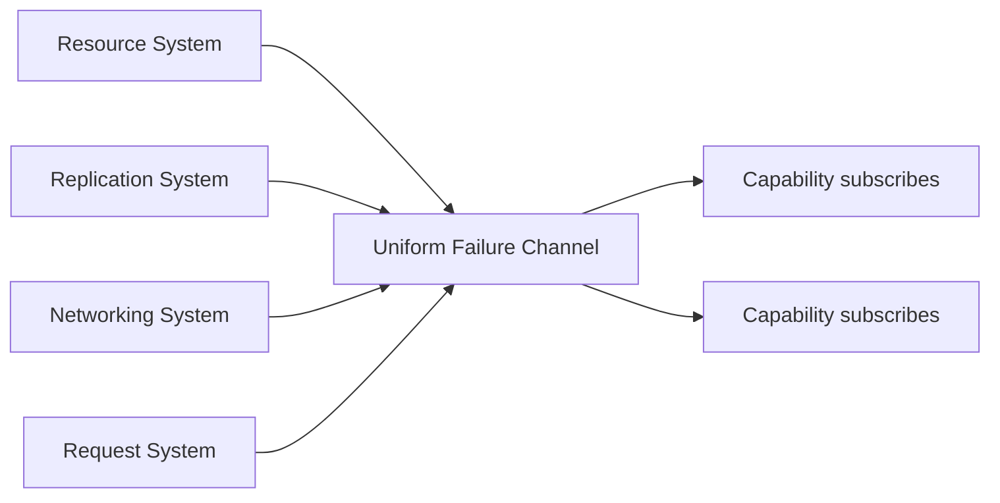

Rather than each system (resource, replication, networking, scheduling) defining its own bespoke failure signaling, every runtime system reports failures as events on this shared channel, using a common failure structure: what failed, which system reported it, and system-specific detail relevant to diagnosing it (e.g. the resource identifier that failed to resolve, or the two contract versions that mismatched).

Capabilities subscribe to this channel the same way they subscribe to any other event — through the existing event delivery mechanism (§15, Runtime Responsibilities). There is no separate failure-handling API to learn; failures are events like any other, just originating from the runtime rather than application logic.

This keeps failure handling consistent with the rest of the platform's design: one mechanism, reused everywhere, rather than a proliferation of per-system error-handling conventions that capabilities would each need to learn independently.

A capability that does not subscribe to the failure channel simply does not observe runtime failures relevant to it. Atlas does not impose default failure-handling behavior (e.g. automatic retry, automatic disconnection) — the same way it imposes no default permission model. Applications decide what a failure means and how to respond to it.

### Contract Version Enforcement

Every build produces a contract version, derived from the generated contracts a host was compiled against.

A client and server must have matching contract versions to communicate. There is no partial compatibility and no negotiation.

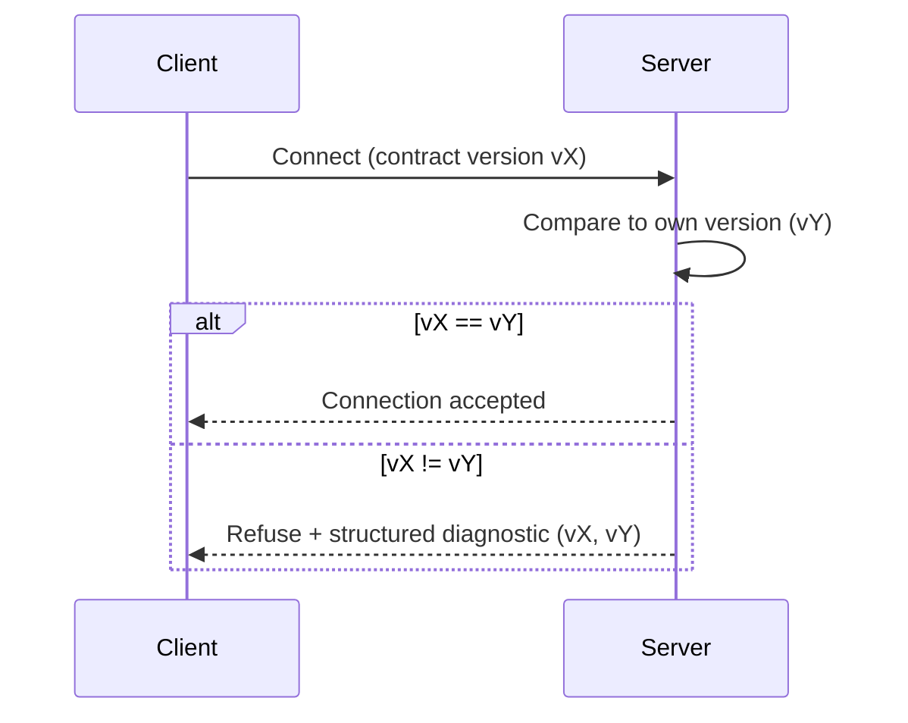

On connection, the server checks the client's contract version against its own. If the versions do not match exactly, the server refuses the connection. No requests are accepted, and no session begins.

This applies uniformly regardless of what changed between versions. A contract version mismatch is refused whether the underlying change was breaking or not — Atlas does not attempt to infer compatibility between versions at connection time.

This keeps the runtime and tooling simple: there is exactly one rule ("versions match, or the connection is refused"), rather than a matrix of partial-compatibility cases to validate and maintain. Any softer compatibility guarantee (e.g. supporting two adjacent versions simultaneously) is an application-level or deployment-level concern, not an Atlas platform guarantee.

Refusal is not silent. When the server refuses a connection due to a version mismatch, it exposes a structured diagnostic containing both the server's contract version and the client's contract version.

This diagnostic is delivered through the normal contract boundary, not as an opaque failure. Applications may surface it to the user in whatever form fits the host (e.g. "client out of date: expected vX, got vY"), route it to logging, or trigger an update flow. Atlas defines the diagnostic's structure and delivery; applications define how it is presented, consistent with the platform's existing division between mechanism and meaning.

---

## 7. Host Composition

Hosts are logical execution contexts rather than operating system processes. An application may compose one or more hosts within a single executable.

Examples include:

- a dedicated server process containing a single server host
- a gameplay client process containing a single client host
- an editor process containing an editor host alongside one or more simulation hosts
- a standalone game containing both a server host and a gameplay client host within the same process

Whether hosts execute in separate processes, within the same process, or across multiple machines is an application deployment decision. Atlas places no architectural distinction between these deployment models.

### Composition Defines Behavior

The behavior of a host is determined by its composition. The process boundary does not define the architecture.

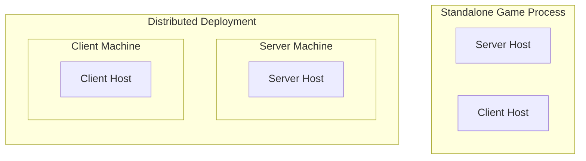

*Both represent the same architectural model. The difference is deployment location, not execution semantics.*

### Host Communication

Hosts communicate through the same generated public contracts regardless of where they execute. Communication may occur through:

- in-process calls
- local transport
- network transport
- test harness integration

The contract boundary remains identical.

---

## 8. Atlas Hosts

Atlas applications are called hosts. Examples include:

- dedicated server
- gameplay client
- editor
- automated testing environment
- command-line tools

Every host shares the same runtime architecture.

A server is not a special host. It differs from other hosts only by:

- capabilities it composes
- authority it possesses
- services it exposes
- deployment environment

The runtime does not distinguish between host types.

- A server is not a special runtime.
- A client is not a special runtime.
- An editor is not a special runtime.

They are all host compositions.

---

## 9. Capability Isolation and Previewing

Because every host is just a composition of capabilities against the same runtime (§8), any capability can be hosted and exercised in isolation — outside the full game, outside the editor, without a running server, without a player. A test harness is a host. A preview tool is a host. A CI job is a host. They differ from a game client only in which capabilities they compose and which backend they attach.

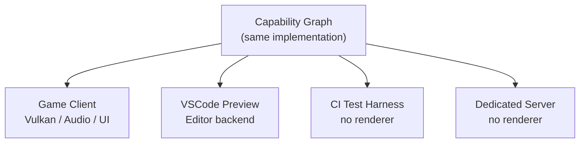

This is §8's "they are all host compositions" taken to its practical conclusion: **the runtime is a library, and the preview tool is just a different deployment of it.**

### Previewing Capabilities Without a Full Game

A capability that produces visual, audio, or physical output can be previewed by composing it into a minimal host with only the dependencies it actually needs — not the full game capability graph. A cloth simulation capability requires only the physics and mesh capabilities it depends on; it does not require networking, combat, or UI.

A cloth QA preview:

```yaml
host: ClothPreview
composes: [entity, physics_cloth, render_mesh, animation]

preview_state:
  Movement.Speed: 4.2
  Wind.Velocity: 20
  Animation: SwordOverheadAttack
```

This is not a "fake cloth viewer" — it is the actual `physics_cloth` capability running. The same code that runs in production runs here. Any bug visible in the preview is a real bug; any result confirmed in the preview is a real result.

The same pattern applies to:

- **Audio**: compose `audio_footstep` + `atlas-input` (mocked) + an audio backend; scrub surface type, footwear, and impact force as properties; hear the actual composed result in real time
- **Particles**: compose the particle capability against a minimal render host; set `Element: Fire`, `Intensity: 0.8`, `Wind: 10` as properties; observe the actual particle capability running
- **Animation**: set `Movement.Speed`, `Character.Haste`, `WeaponType`, `State` as preview properties; render the actual animation graph the game would use
- **Physics**: run a vehicle collision scenario against the actual physics capability; assert `max_penetration`, `max_velocity`, absence of NaN

### Property Scrubbing

Because everything is property-driven (§21, Property and Resource Composition), a preview host can expose its full property state to a UI — and changes to any property immediately re-resolve the capability graph, producing updated output. This makes continuous, interactive previewing a natural consequence of the architecture, not a special tooling feature:

```
ImpactForce
0 ─────────────────── 100
                   ^
                  75

→ volume scaling, pitch changes, additional audio layers, distortion, reverb
  all re-resolve in real time as the slider moves
```

The preview tool is not simulating the capability behavior. It is running it.

### Automated Capability Testing

The same host isolation that enables interactive previewing enables automated testing in CI. A test harness host composes only the capabilities under test, provides controlled inputs, and asserts against outputs — using the same determinism guarantees (§4) that make replay and resimulation possible:

```yaml
test: ClothStabilityTest
host: ClothPreview

scenarios:
  - animation: run
    duration: 30s
  - animation: jump
    duration: 10s
  - wind: 50kmh

assertions:
  max_penetration: 2mm
  max_velocity: 100m/s
  no_nan: true
```

Every asset build can detect unstable cloth, bad collision proxies, and exploding constraints before they reach players — against the actual runtime implementation, not a test approximation of it.

### The Common Pattern

Every Atlas subsystem follows the same pipeline shape:

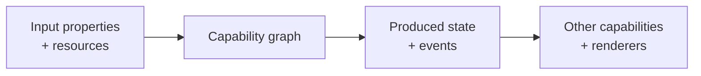

Physics, audio, UI, animation, particles, clothing — all instances of the same pattern: input properties feed a capability graph, which produces state and events that other capabilities and renderer backends consume. This uniformity is what makes capability isolation previewing work across every domain without special-casing any of them.

---

## 10. The Editor Is a Client

The Atlas Editor is an Atlas client. It is not a special execution mode. It is not a separate object model.

It uses the same:

- runtime
- generated contracts
- reflection metadata
- entity model
- resource identities
- configuration
- networking

as every other Atlas client. The editor differs from a gameplay client only by the additional capabilities it composes.

### Editor Capabilities

The editor may compose capabilities for:

- entity inspection
- property editing
- resource preview
- request execution
- server connection
- simulation observation
- debugging

These capabilities use the same public contracts available to every Atlas application.

### Editor as a Platform Consumer

The editor does not receive privileged access to application internals. Instead, it consumes the same systems exposed to all hosts:

- contracts
- reflection
- resources
- requests
- events
- replication

This ensures that editor behavior remains aligned with runtime behavior.

---

## 11. Repository Layout

Atlas is intended to be included directly into a project. A typical project structure is:

```
MyGame/
├── CMakeLists.txt
├── atlas.project
├── external/
│   └── atlas/
├── modules/
├── src/
├── resources/
├── config/
├── tests/
└── generated/
```

Atlas is commonly added as:

- a git submodule
- a source dependency
- an equivalent package-managed dependency

Atlas requires no global installation. The application owns the final build environment.

### Curated Capability Repositories

Atlas maintains a curated set of capabilities, distributed as separate repositories, that developers may optionally depend on — for example, a targeting/area-effect capability built on Property and Resource Composition (§20), or common gameplay, UI, and utility capabilities.

A curated capability repository is architecturally an ordinary capability library (§13, Library Architecture). It follows the same rules as any other capability:

- it is added to a project the same way (git submodule, source dependency, or equivalent — see above)
- its dependencies follow the same layering rules (§5, Dependency Model)
- it is composed at compile time, like any other capability (§4)
- it is versioned and compatibility-checked the same way any generated contract is (§6, Contract Version Enforcement)

"Curated" describes provenance and maintenance — Atlas-authored, reviewed, and kept compatible across Atlas versions — not a distinct architectural category. A curated capability carries no special runtime privilege and is not treated differently by the runtime or tooling than a capability a developer writes themselves.

**Forking and replacement.** Because a curated capability is an ordinary dependency, a developer may fork, vendor, or fully replace it with their own implementation. A game that wants its own targeting logic can depend on its own capability instead of a curated one, or compose both side by side under different names. Nothing in the runtime or build model distinguishes a curated dependency from a project's own — replacing one is exactly as supported as swapping any other capability dependency.

---

## 12. Build Model

The application owns the build. Atlas contributes tooling.

The build system invokes Atlas tooling before normal C++ compilation begins. Atlas tooling performs:

- capability validation
- contract generation
- reflection generation
- resource compilation
- documentation generation
- dependency validation

Generated code becomes ordinary C++ source. Generated artifacts participate in the normal application build pipeline.

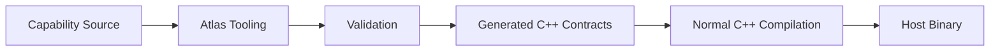

### Compile-Time Validation

Atlas validates the application graph before execution. Validation includes:

- capability dependency graphs
- contract compatibility
- request signatures
- event definitions
- serialization schemas
- stage ordering
- resource references
- host composition rules

Invalid compositions fail during compilation rather than producing runtime discovery failures.

### Build Artifacts

A successful Atlas build produces:

- generated C++ contracts
- reflection metadata
- serialization metadata
- resource identifiers
- documentation metadata
- validated host configurations

These artifacts are consumed by normal runtime code. Atlas does not require a separate runtime compilation phase.

---

## 13. Library Architecture

Atlas is organized as independent libraries.

```
atlas/
├── include/
├── src/
├── tools/
├── generators/
├── tests/
└── libraries/
    ├── atlas-contracts
    ├── atlas-core
    ├── atlas-entity
    ├── atlas-reflection
    ├── atlas-request
    ├── atlas-stage
    ├── atlas-scheduler
    ├── atlas-serialization
    ├── atlas-replication
    ├── atlas-resource
    ├── atlas-runtime
    ├── atlas-input
    ├── atlas-ui
    └── atlas-editor
```

- Libraries expose stable public interfaces.
- Implementation remains private.
- Dependencies always point downward toward lower-level libraries.

### Library Responsibilities

Each library provides a focused architectural responsibility.

| Library | Provides |
|---|---|
| `atlas-contracts` | contract definitions, generated interfaces, public schema representation |
| `atlas-core` | foundational types, common utilities, platform primitives |
| `atlas-entity` | entity identity, entity lifecycle, entity management mechanisms |
| `atlas-reflection` | runtime metadata access, reflected structure discovery, tooling integration |
| `atlas-request` | request definitions, request execution infrastructure, request routing |
| `atlas-stage` | execution stages, lifecycle organization, deterministic ordering boundaries |
| `atlas-scheduler` | job scheduling, execution ordering, runtime coordination |
| `atlas-serialization` | serialization mechanisms, data encoding, persistence support |
| `atlas-replication` | state synchronization, replication mechanisms, network data distribution |
| `atlas-resource` | resource identity, resource resolution, resource management |
| `atlas-runtime` | host execution environment, runtime integration, coordination between systems |
| `atlas-input` | raw platform input polling, binding configuration, Intent event production; the sole source of `Intent` events entering the capability pipeline — raw key/button/axis data never crosses this boundary |
| `atlas-ui` | UI node tree, property binding infrastructure, behavior primitives (Clickable, Focusable, etc.), compositing layer management, backend dispatch |
| `atlas-editor` | reusable editor capabilities, editor infrastructure, tooling integration |

The editor library remains optional. Gameplay applications do not depend on editor functionality. `atlas-input` and `atlas-ui` are similarly optional — a headless server host composes neither.

### Capability Manifest

Every capability is declared by a single manifest — one YAML file per capability — covering both its structure (§14, Declarative Source Format: properties, requests, events, dependencies) and its identity as a build unit (source files, contract versions). Earlier sections of this document showed structural fields in isolation for brevity; the canonical, complete shape combines both under one `capability` block:

```yaml
capability:
  name: DamageResolution
  version: 1.4.0

depends_on:
  - entity
  - health

properties:
  ActiveResistance:
    physical: int32
    elemental: int32

requests:
  ResolveDamage:
    target: EntityRef
    instance: DamageInstance

events:
  DamageResolved:
    target: EntityRef
    final_amount: int32

source:
  root: src/
  files:
    - damage_resolution.cpp
    - modifiers.cpp
    - resistance.cpp
  includes:
    - include/

contracts:
  consumes:
    - id: atlas.combat.impact-event
      version: ^2.0
  produces:
    - id: atlas.combat.damage-event
      version: 1.0
```

- **`capability`** identifies the capability and its own version, following ordinary semantic versioning.
- **`depends_on`** declares the capability's dependencies at capability granularity, feeding the dependency graph and cycle detection described in §5. This is the sole mechanism by which execution order is determined — including broad ordering concerns like "presentation runs after simulation" (§5, Ordering Without Stages) — there is no separate stage or phase concept alongside it.
- **`properties`**, **`requests`**, **`events`** declare the capability's structural contract, exactly as described in §14 — generated into `constexpr` C++ contracts, never containing behavior (§14, The Declarative Boundary).
- **`source`** describes the build unit — which files and include paths Atlas tooling compiles as this capability's manual implementation (§14, Manual Implementation).
- **`contracts.consumes`** and **`contracts.produces`** declare the capability's position in the dependency graph in terms of the specific contracts it depends on and exposes, at a finer grain than `depends_on` alone — see Manifest Versioning vs. Contract Version Enforcement, below, for how this interacts with §5 and §6.

Examples elsewhere in this document that show only `depends_on` and a subset of structural fields (§19, §21) are abbreviated for readability — they omit `source` and `contracts` where the example's point doesn't depend on build/versioning detail, not because those fields are optional in a real manifest.

### Manifest Versioning vs. Contract Version Enforcement

The version ranges in a manifest's `consumes` block (e.g. `^2.0`) are a **build-time dependency resolution concern**, resolved by Atlas tooling when a host's capability graph is composed — the same role a package manager's version range plays when resolving a dependency graph before compilation. Tooling resolves each range to a single concrete contract version, validates the resulting graph against the same acyclic dependency rules already defined in §5, and fails the build if no compatible resolution exists.

This is a distinct concept from the contract version described in §6 (Contract Version Enforcement), and the two must not be conflated:

| | Manifest contract versions | §6 host contract version |
|---|---|---|
| **Scope** | Between capabilities, within a single build | Between a client host and a server host, at connection time |
| **Resolution** | Semantic version ranges, resolved by tooling at build time | Exact match only, checked at connection time |
| **Failure mode** | Compile-time build failure (§12, Compile-Time Validation) | Connection refused, with structured diagnostic (§6) |

A resolved build — the output of manifest-driven dependency resolution — produces exactly one concrete contract version for the host as a whole. It is *that* single resolved version §6 checks against a connecting client's, exact-match, with no ranges involved at that stage. Manifest version ranges give capability authors flexibility in what they depend on; §6's exact match gives runtime hosts certainty about what they're talking to. Loosening one does not loosen the other.

---

## 14. Generated Contracts

Capability definitions generate strongly typed C++ contracts. Generated artifacts include:

- property types
- identifiers
- reflection metadata
- serialization metadata
- resource identifiers
- documentation metadata

Generated code defines structure. Generated code never contains application logic.

Contracts are built as `constexpr` metadata rather than data merely produced by the build and inspected at runtime. This is what makes tiny-interface contract satisfaction (§5, Tiny Interface Composability) a compile-time fact with no runtime lookup cost — the same generation step that produces a capability's contract also makes that contract's shape available to the compiler for structural checking.

### Contract Purpose

Contracts provide the stable communication boundary between:

- capabilities
- hosts
- tools
- runtime systems
- external integrations

A contract describes **what exists**. It does not define **how** behavior is implemented.

### Manual Implementation

Developers implement algorithms manually. Examples include:

- gameplay rules
- simulation algorithms
- AI behavior
- application workflows
- domain-specific systems

Atlas generates infrastructure. Applications provide meaning.

### Declarative Source Format

Capability structure — properties, requests, events, dependencies, composition strategy — is authored as data (YAML, or an equivalent structured format) rather than hand-written C++. Atlas tooling consumes this declaration and generates the corresponding `constexpr` contracts, concept constraints, and boilerplate described above.

Host composition follows the same declarative model. A host's capability list is data, the same as a capability's structure:

```yaml
host: GameplayClient
composes:
  - entity
  - health
  - health_ui_bridge
  - lua_ui_framework
  - wotlk_addon_compat
  - replication
  - networking_client
```

Atlas tooling generates the corresponding `atlas::Host<...>` composition (§21, Worked Example) from this declaration, validating it against the same dependency and cycle rules that apply to any composition (§5).

There is one tool and one generation step, used uniformly for capability structure and host composition — not a separate mechanism for each. This is a direct extension of §12 (Compile-Time Validation): the tooling that already validates dependency graphs, contract compatibility, and stage ordering consumes the declarative source as its input, rather than parsing hand-written C++ for the same information.

### The Declarative Boundary

The declarative format expresses **structure and composition** — what exists, what a capability depends on, what a host composes, how a property's contributions combine (§20, Composition Strategies). It never expresses **behavior**.

Concretely, the declarative format may express:

- properties, requests, events, and their types
- a capability's dependencies
- a host's composed capabilities
- a property's composition strategy (Additive, Priority Override, and so on — §20)
- a filter or strategy's *parameters* (e.g. a range value, a faction name, a priority ordering)

It may never express:

- conditionals, branching, or control flow
- what a request handler does when validation fails
- the algorithm behind a filter or composition strategy
- any per-tick or per-event logic

The moment a declaration needs an `if`, it has stopped describing structure and started describing behavior — and behavior is manual implementation (§14, Manual Implementation), written in C++ against the generated contract. A filter such as `MaxTargets` is declared in YAML only insofar as *which* filter and *what parameter* (`MaxTargets: 10`); the filter's own evaluation logic is a capability, written in C++, the same as `AuraCapability`'s engine would be.

This mirrors the platform's central boundary (§2, Mechanism Over Meaning) at the level of the tooling itself: Atlas — and the declarative format Atlas consumes — defines what can be composed and how contributions interact. It does not, and structurally cannot, drive logic. Logic remains entirely the developer's, expressed in C++ against the contracts the declaration generates.

---

## 15. Runtime Libraries

The runtime consists of reusable libraries, shared by every Atlas host. Examples include:

- entity management
- scheduling
- serialization
- replication
- resource management
- rendering integration

A gameplay client and an editor link the same runtime libraries.

### Runtime Responsibilities

| The runtime provides | The runtime does not provide |
|---|---|
| deterministic execution | gameplay rules |
| lifecycle management | application semantics |
| system coordination | domain-specific behavior |
| resource access | |
| request execution | |
| event delivery | |
| scheduling | |

### Runtime Stability

The runtime remains intentionally stable. New functionality is introduced through:

- capabilities
- libraries
- generated contracts

rather than expanding the runtime itself. This keeps the execution foundation predictable.

---

## 16. Capability Libraries

A capability consists of one or more libraries. Example:

```
combat/
    combat

combat-editor/
    combat-editor
```

- The gameplay application links: `combat`
- The editor links: `combat`, `combat-editor`

### Capability Independence

Capabilities remain usable without editor-specific libraries. A capability does not require:

- editor support
- visualization tools
- debugging tools
- authoring interfaces

Those are optional extensions.

### Capability Composition

Capabilities are combined during compilation. Composition determines:

- available behavior
- available contracts
- generated metadata
- host functionality

The runtime executes the resulting validated composition.

---

## 17. Editor Libraries

Editor functionality is provided through ordinary Atlas libraries. Examples include:

- property inspector
- hierarchy view
- asset browser
- viewport
- gizmos
- debugging tools
- profiling tools

The editor is built by linking these libraries into an Atlas host.

### Editor Isolation

The gameplay client remains free of editor dependencies. Editor functionality does not exist as hidden runtime behavior. Instead:

- gameplay code provides capabilities
- editor code provides optional tooling
- contracts connect the two

This keeps runtime builds minimal.

---

## 18. Editor Extensions

Capabilities may provide optional editor integrations. Examples include:

- custom inspectors
- visual debugging
- property editors
- scene overlays
- preview rendering

When no editor extension exists, Atlas provides generic editing through generated reflection metadata. Custom editor support enhances the experience without being required.

---

## 19. UI System

Atlas provides a UI system as a capability layer. It is not a UI framework in the traditional sense — it does not define `Button`, `Window`, or `Panel` as named widget types. It defines the **minimum contract** through which capabilities describe interfaces without knowing the final toolkit: a bindable property tree, resource references, input events, and composition. A backend (GPU-native, editor-native, or otherwise) renders that contract however it chooses. The game never sees the backend; the backend never sees the game.

This is the same pattern as the 3D and audio renderers: game state flows into a renderer, which produces output. The UI renderer is the third leg of that arrangement:

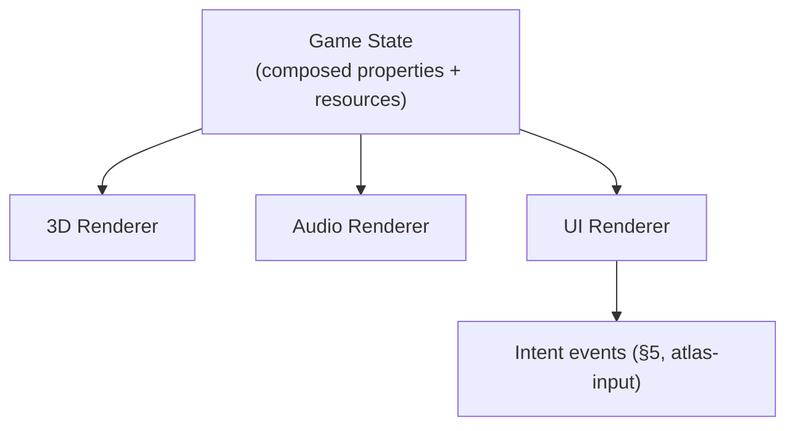

The UI renderer consumes properties, resources, and state. It produces `Intent` events — the same `Intent` events `atlas-input` produces from hardware input. A button click and a keypress are indistinguishable to the capabilities below them.

### Minimum UI Contract

Atlas does not define widget types. It defines **primitives** from which any widget can be composed, following the same capability composition philosophy applied everywhere else (§5, Tiny Interface Composability):

- **Node** — a positioned, sized element in the UI tree, with a transform and optional children
- **Bindable property** — any node property (`visible`, `color`, `text`, `value`) may be bound to a composed game property (§20), re-evaluated whenever that property's effective value changes (§20, Continuous Re-resolution)
- **Resource reference** — any node property may reference an external asset (`icon`, `background`, `font`) through ordinary resource identity (§3, Resource)
- **Behavior** — small, composable capabilities a node may carry (`Clickable`, `Focusable`, `Draggable`, `Tooltip`, `CooldownOverlay`)

A `Button` is not a built-in type. It is `Node + Text + Background + Clickable + Focusable`. An ability slot is:

```yaml
widget: AbilitySlot
behaviors: [Clickable, Tooltip, CooldownOverlay]

bind:
  icon:     resource: FireballIcon
  cooldown: property: FireballCooldown
  enabled:  property: CanCastFireball

on_click:
  intent: CastAbility
  params:
    ability: Fireball
```

No special "spell bar widget type." The capability that owns `AbilitySlot` composes existing behaviors onto a node and declares its bindings — same composition model as everything else.

### Compositing Layers

The UI renderer composites in three fixed macro-layers, always in this order:

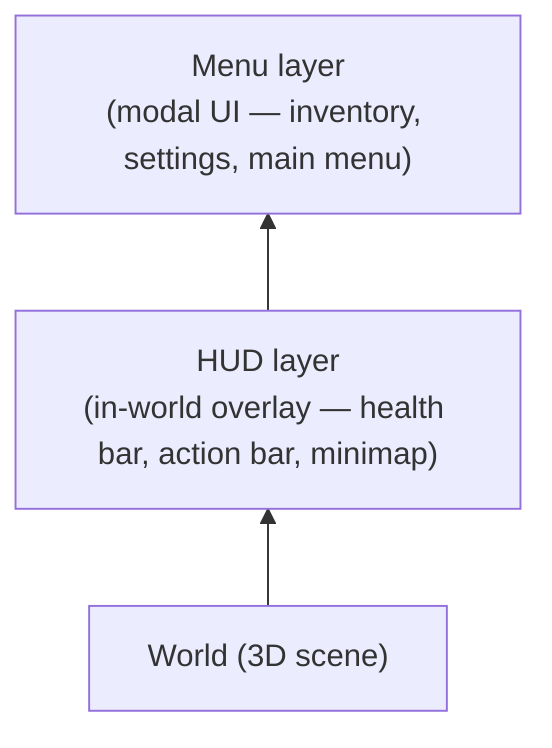

Each macro-layer has its own internal Ordered Composition (§20) for widget stacking — tooltips, panels, overlays within a layer use exactly the same mechanism as `MaterialLayers` does for character skin layers, just producing draw calls rather than texture layers. A tooltip is an internal layer of whichever macro-layer spawned it; it never needs to jump macro-layers.

### Art Style vs. Player Styling

**Art style** is declared structure (§14, Declarative Boundary) — layout, decoration, color defaults, 9-slice borders. It is authored by the developer, compiled in, and not player-editable:

```yaml
style: PanelBackground
resource: panel_border_9slice.png
slicing: { left: 8, right: 8, top: 8, bottom: 8 }
```

**Player styling** is a Priority Override (§20) contribution over a developer-declared `player_overridable` allowlist. The developer explicitly opts individual properties into player override; everything else (layout, decoration) is structurally unreachable:

```yaml
widget: HealthBar
style:
  fill_color: "#c0392b"
  player_overridable: [fill_color]   # layout, decoration NOT listed — not overridable
```

A `player_ui_style` capability contributes override values at higher priority than the art-style base, for opted-in fields only. When and where to persist those values is a capability-logic concern (§20, Contribution Lifetime) — Atlas provides the serialization mechanism (`atlas-serialization`, §13), game logic decides what to save and when.

### UI Capability Packages

The core UI system provides only the primitive contract above — nodes, bindings, behaviors, compositing layers. Higher-level widget vocabularies (`Button`, `InventoryGrid`, `Timeline`, `Inspector`) are supplied as separate capability packages, following the same curated-capability-repository model described in §11. The Atlas team intends to provide a standard set of these packages; games may also compose their own.

### Backend Implementations

The UI renderer contract is backend-agnostic. Any renderer that can consume a node tree with resolved property values and resource references may serve as the UI backend:

- a GPU-native renderer (for game HUDs requiring high throughput and custom shaders)
- an editor-native toolkit (well-suited for authoring tools and inspectors)
- a web renderer
- a terminal renderer

The game never references the backend. Backend selection is a host composition and deployment concern, not a capability concern.

### Architectural Placement

The UI system is delivered as one or more ordinary capabilities (§3, Capability), following the same rules as any other:

- composed at compile time (§4, Compile-Time Composition)
- depends only on lower-level capabilities and runtime libraries (§5, Dependency Model)
- exposes its surface through generated contracts (§14, Generated Contracts)
- a game that does not compose it pays no cost for its existence (§16, Capability Independence)

### WotLK Addon Compatibility

WotLK addon compatibility is an **optional, separately-composable capability** built on top of the native UI system above. It is not the UI framework itself — it is a Lua API layer that exposes the native UI contract through the familiar WotLK `CreateFrame`/`RegisterEvent`/`OnEvent` surface, so that existing third-party addons can build UI against it.

Under the hood, `CreateFrame` constructs the same native node primitives the declarative YAML generates — meaning addon-built UI and developer-built UI render through one underlying system, through different front doors. The §19 Request Boundary rules apply uniformly regardless of which door was used.

Introducing Lua does not introduce a second execution model. The Lua runtime is embedded and driven by ordinary Atlas systems the same way any other capability's logic is driven. Lua scripts do not bypass the request/event contract boundary to reach into simulation state directly.

### Request Boundary

Lua and addons may build UI freely — creating frames, buttons, action bars, and wiring them to send requests, following ordinary WotLK addon authoring (§19, Addon Compatibility Layer). The boundary is not "Lua cannot issue requests." It is narrower and more specific, and mirrors the real distinction WotLK-era addon policy already draws between ordinary macros/UI and disallowed automation:

**A Lua-issued request is valid only if both of the following hold:**

1. **It is triggered synchronously by a real, discrete input action** — the player clicking a button or pressing a bound key, in that same instant. It is never triggered by an event callback, a timer, or any other code path that runs without a corresponding input action occurring right then.
2. **The logic between the input and the request is a static conditional lookup over currently-visible state** — selecting among a small, author-declared set of possible requests based on simple conditions (target type, buff presence, current form) — never a computed decision (best target, nearest enemy, optimal rotation), never a search, and never anything that reasons about the game state to produce a choice rather than merely look one up.

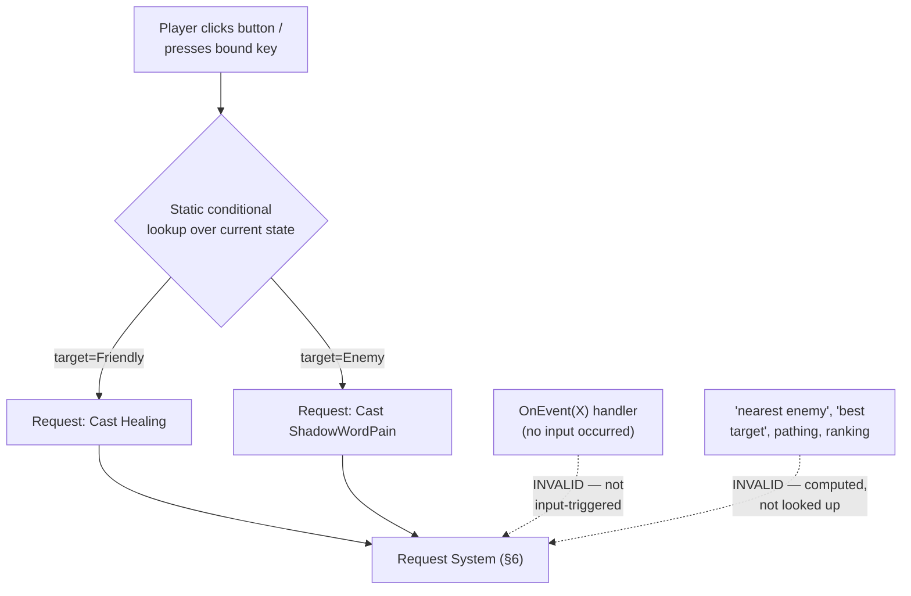

**Valid**, because it is triggered by a real click and only looks up a fixed choice from currently-visible state:

```lua
-- One button, one click, choosing between two fixed, pre-declared requests
-- based on the current target's disposition. No computation, no search.
local function OnButtonClick()
    if UnitIsFriend("player", "target") then
        Atlas.CastRequest("Healing")
    elseif UnitIsEnemy("player", "target") then
        Atlas.CastRequest("ShadowWordPain")
    end
end
```

**Invalid**, because nothing was clicked — the request is triggered by an incoming signal, and it is Lua deciding to act, not the player:

```lua
-- INVALID: reacts to an event, not an input action.
-- This is the addon acting on the player's behalf, not for them.
f:RegisterEvent("UNIT_TARGETING_ME")
f:SetScript("OnEvent", function(self, event, sender)
    Atlas.CastRequest("Retaliate", target = sender)  -- rejected
end)
```

**Invalid**, because "nearest" and "best" are computed decisions, not a lookup among fixed pre-declared options:

```lua
-- INVALID: computes a target/choice rather than looking one up
-- among options the player already specified.
local function OnButtonClick()
    local target = FindNearestEnemy()          -- computation — not allowed
    local spell  = ChooseBestSpellFor(target)   -- computation — not allowed
    Atlas.CastRequest(spell, target = target)
end
```

This is the same shape as WotLK's own secure macro/action-button model: conditionals like `[target=Friendly]` are allowed because they resolve instantaneously against state visible at the moment of a real click; anything that runs independently of a click, or that searches/ranks/paths rather than looks up a fixed choice, is not. Atlas enforces this at the request boundary rather than relying on convention: the compatibility layer (§19, Addon Compatibility Layer) only exposes a request-issuing API shaped as a synchronous, input-bound conditional dispatcher — there is no API surface through which an event handler or a computed value can reach the Request System at all, so the invalid patterns above are not merely discouraged, they have no function capable of expressing them.

Outside of issuing requests through that narrow, input-bound path, Lua and addons remain strictly presentation-side and read-only with respect to simulation state — this is not a convention, it is an architectural boundary the same way audio and rendering are excluded from the deterministic boundary (§4, Deterministic Execution):

- Lua scripts and addons **read** replicated/observable state through the same contracts any client capability would use (§6, Server Authority — "client hosts observe replicated state"), and may freely build UI, display logic, and event-driven *presentation* (updating a health bar display, playing a sound, flashing a warning) in response to any event — the input-triggering restriction above applies only to issuing requests, not to observing and displaying state.
- Lua scripts and addons never read or write simulation state directly, never participate in deterministic scheduling, and are not part of the bit-exact replay boundary (§4). A replay reproduces simulation outcome; it does not require the UI layer to run identically, the same way it does not require rendering to run identically.
- Because addons sit outside the deterministic boundary, non-deterministic behavior in Lua (which is expected, given real-world addon code) has no effect on simulation correctness, cross-machine reproducibility, or replay validity.

This keeps the addition consistent with the rest of the platform: Atlas adds a new *capability*, not a new kind of runtime guarantee. The mechanism that matters — determinism, authority — remains untouched; what's added is a narrowly-shaped, input-bound path by which presentation-side Lua code can still participate in issuing ordinary, validated requests, without that path being usable to automate gameplay decisions on the player's behalf.

### Addon Compatibility Layer

A dedicated capability provides a compatibility layer targeting the WotLK (3.3.5) addon API surface, so existing unmodified addons can run against Atlas games that compose it.

This includes, at minimum:

- the FrameXML-era frame object model (`CreateFrame`, frame inheritance/templates, anchors and regions)
- the standard event-registration model (`RegisterEvent`, `OnEvent` handlers) mapped onto Atlas's own event delivery (§15, Runtime Responsibilities) for the events an addon expects to exist
- the Lua global API surface addons commonly depend on (string/table utilities, `SavedVariables`-style persistence, slash commands)
- XML-defined UI templates, to the extent addons rely on declarative frame layout rather than pure Lua construction

Compatibility is targeted at **existing, unmodified addons** as the goal, not merely an API "inspired by" the WotLK style. Where full fidelity isn't achievable (e.g. APIs that assumed WoW-specific game rules Atlas has no equivalent concept of — §2, Mechanism Over Meaning), that gap is a property of this specific compatibility capability, not a compromise to the rest of the platform: an addon calling into WoW-specific game logic is asking a *game rules* question, and Atlas capabilities providing that compatibility layer must supply their own equivalent concept, the same way any capability defines its own semantics.

### What Games Gain

- A game may compose the Lua UI capability alone, to get a scripted UI framework without addon compatibility.
- A game may additionally compose the WotLK compatibility capability, to allow existing third-party addons to run against the game's own UI state, so long as the game exposes the events and data those addons expect (which is the game's responsibility to provide via its own capabilities, not Atlas's).
- A game that composes neither is unaffected — the framework and compatibility layer are both optional capabilities, consistent with §16 (Capability Independence).

### Worked Example: Exposing an Event to an Addon

This example extends the `health` capability from §21 (Worked Example) to show how a game bridges its own gameplay event to the Lua UI layer, so that a WotLK-style addon can consume it — without `health` itself knowing that Lua, UI, or addons exist.

```mermaid
flowchart LR
    Health["health capability<br/>(§21 — unmodified)"] -->|"publishes HealthChanged"| Bridge["health-ui-bridge capability"]
    Bridge -->|"fires UNIT_HEALTH"| LuaFramework["Lua UI Framework"]
    LuaFramework -->|"OnEvent(\"UNIT_HEALTH\")"| Addon["Third-Party Addon<br/>(unmodified WotLK Lua)"]
```

**`health` stays exactly as defined in §21.** It publishes `HealthChanged` as an ordinary contract event. It has no dependency on, or awareness of, any UI or Lua capability — consistent with §5 (capabilities may depend only on lower-level capabilities, and `health` is lower-level than any UI concern).

**A new capability, `health-ui-bridge`, depends on both `health` and the Lua UI framework capability**, and translates between them. The dependency itself is declared the same way `health` was — as data (§14, Declarative Source Format). This example is abbreviated (§13, Capability Manifest) to just the fields it needs; a real manifest also carries `source` and `contracts`:

```yaml
capability:
  name: health_ui_bridge
depends_on: [health, lua_ui]
```

Only the translation logic is hand-written C++, since it's behavior, not structure:

```cpp
// health_ui_bridge.cpp — hand-written, not generated

void on_event(atlas::Context& ctx, const health::HealthChanged& evt)
{
    ctx.lua().fire_event("UNIT_HEALTH", evt.target, evt.new_current);
}
```

This is ordinary manual implementation (§14, Manual Implementation), not a runtime mechanism. `health-ui-bridge` is the only place that knows both "what `HealthChanged` means" and "what event name an addon expects" — `health` and `lua-ui-framework` remain mutually unaware of each other, each reusable independently (§4, Capability Isolation).

**The addon itself is unmodified WotLK-style Lua**, registering for the event through the compatibility layer's `OnEvent` model (§19, Addon Compatibility Layer):

```lua
local f = CreateFrame("Frame")
f:RegisterEvent("UNIT_HEALTH")
f:SetScript("OnEvent", function(self, event, unit, current)
    if unit == "player" then
        HealthBarFrame:SetValue(current)
    end
end)
```

Nothing about this addon changes based on whether it's running in the original game the API was designed for or in an Atlas game composing `health-ui-bridge` — which is the point of the compatibility layer.

**Composing the host** (§14, Declarative Source Format):

```yaml
host: GameplayClient
composes:
  - entity
  - health
  - health_ui_bridge
  - lua_ui
  - wotlk_addon_compat
  - replication
  - networking_client
```

What this illustrates:

- The presentation-only boundary (§19, Request Boundary) holds end to end: the addon only ever observes replicated state via `UNIT_HEALTH`, and never touches `Health` or `ApplyDamage` directly.
- A single small bridge capability is sufficient to connect an existing, unmodified gameplay capability to an existing, unmodified addon — neither side is aware of the other, consistent with §2 (Mechanism Over Meaning): `health-ui-bridge` is where "meaning" (health maps to `UNIT_HEALTH`) is decided, not `health` and not Atlas.
- A game that doesn't want addon support simply omits `health-ui-bridge`, `lua-ui-framework`, and `wotlk-addon-compatibility` from its host composition; `health` is unaffected either way (§16, Capability Independence).

---

## 20. Property and Resource Composition

Property Composition is the mechanism by which multiple, mutually unaware capabilities contribute to a single effective value. It generalizes the tiny-interface principle from §5: where §5 defines how a capability depends on a narrow slice of structure, this section defines how several capabilities independently *contribute to* that structure without depending on each other.

The mechanism is domain-agnostic. The same composition model applies to:

- gameplay values (movement speed, armor, damage)
- animation and pose selection
- particle and visual effects
- skeleton and skin layering
- material layering
- audio sources
- UI state
- AI parameters
- configuration overrides

Property Composition does not define meaning. It defines **how** independent contributions combine into a value — not what that value represents. This is Mechanism Over Meaning (§2) applied to composition itself: Atlas knows how to combine contributions; it does not know what an "aura" or a "weapon glow" is.

### Design Goals

**Independent contributions.** Multiple capabilities affect the same property without knowing about each other. An equipment capability, an aura capability, and a terrain capability can each contribute to `MovementSpeed` with no dependency between them:

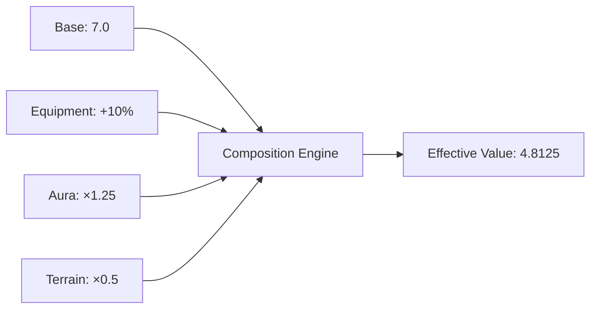

*The movement capability that reads the effective value has no dependency on the equipment, aura, or terrain capabilities that contributed to it.*

**No domain knowledge.** The composition system knows only:

```
Property + Contributions + Composition Strategy = Effective Value
```

It has no knowledge of spells, weapons, characters, animations, particles, or materials — the same boundary already drawn in §2 (Mechanism Over Meaning).

**Properties and resources share one model.** A property may hold a numeric value, state, a reference, a resource, a collection, or structured data. The same composition mechanism applies regardless. `Health`, `MovementSpeed`, `CurrentAnimation`, `ParticleEffects`, `MaterialLayers`, and `ActiveAudioSources` are all, structurally, properties composed the same way.

### Terminology

| Term | Meaning |
|---|---|
| **Property** | A named value associated with an entity (e.g. `MovementSpeed: float`) |
| **Resource** | An external asset referenced by a property (e.g. an `AnimationResource`). Resources are values — they compose like any other property. |
| **Contribution** | An independent input to a property: a source, a value, a priority, metadata, and a lifetime |
| **Effective Value** | The result of combining the base value with all active contributions through the property's composition strategy |

A property's definition specifies its type, its composition strategy, its default/base value, and its validation rules — it does not enumerate every possible contribution up front. Like any other capability structure, it is authored declaratively (§14, Declarative Source Format):

```yaml
property: MovementSpeed
type: float
composition: Multiply
base: 7.0
```

Tooling generates the corresponding constexpr contract:

```cpp
// GENERATED — movement_speed.property.hpp

struct MovementSpeed {
    static constexpr auto composition = atlas::Composition::Multiply;

    float base = 7.0f;
};
static_assert(atlas::PropertyContract<MovementSpeed>);
static_assert(atlas::Composable<MovementSpeed>);
```

### Composition Pipeline

Every property resolves through the same pipeline:

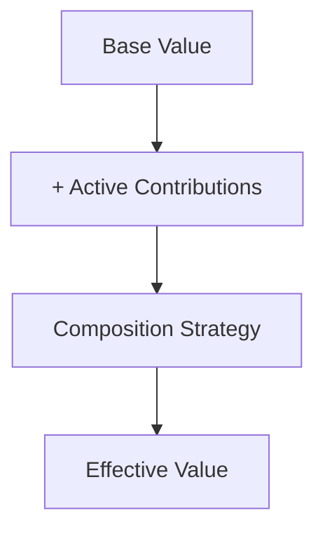

### Continuous Re-resolution and Preemption

The pipeline above is not computed once when a contribution is added. It re-resolves whenever the active contribution set for a property changes — a contribution is added, a contribution is removed, or a contribution's lifetime (§20, Contribution Lifetime) expires.

This matters most for strategies like **Priority Override**, where the effective value is a single winner among several candidates. When a new contribution is added with a higher priority than the current winner, it preempts immediately — the property's effective value changes on the same tick the new contribution is registered, without the losing contribution needing to be explicitly withdrawn first.

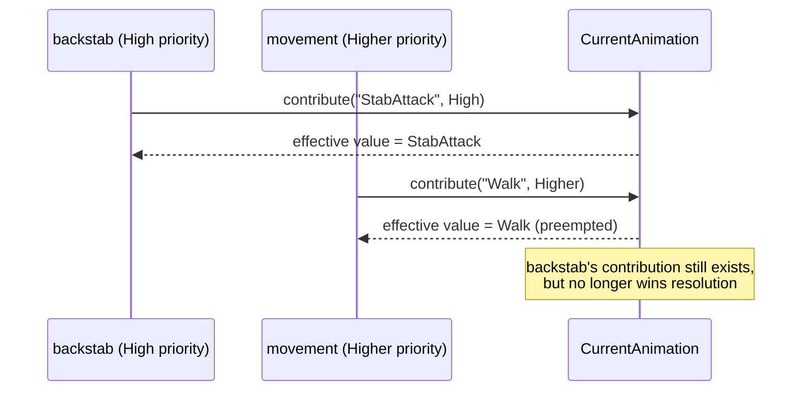

A preempted contribution is not deleted — it remains registered, with its own lifetime, and may win resolution again later if the contribution that preempted it is removed first. Whether that's the right behavior for a given property is a modeling decision made when the property declares its composition strategy and the priorities its contributors use, not a runtime policy Atlas imposes.

**No cross-capability coupling is required for preemption to work.** A capability contributing at a given priority does not need to know what, if anything, it might preempt or be preempted by — it only declares its own contribution and priority. This is what keeps §4 (Capability Isolation) intact under interruption: `movement` contributing `CurrentAnimation` at a higher priority than an in-progress attack's animation is sufficient to end the attack's visible presentation, without `movement` referencing `backstab`, or `backstab` referencing `movement`, at all. The correct outcome falls out of declared priorities, not negotiated coupling between capabilities.

This is also why presentation state can never be "locked": nothing about the composition model gives a contribution the ability to block a higher-priority one from taking over. A capability that wants an attack to be uninterruptible for a period does so by contributing at a high enough priority for that period — not by any mechanism that prevents other contributions from being registered.

### Continuous vs. Triggered Composition

Everything described above assumes a property is a **standing** composition: contributions are added and removed independently, each carries its own lifetime (§20, Contribution Lifetime), and an effective value exists continuously between resolutions, re-resolving whenever the active set changes. `MovementSpeed`, `ActiveAudioSources`, and `MaterialLayers` are all standing properties in this sense — there is always a current effective value, whether or not anything just changed.

Not every composition fits this shape. Some outputs are meaningful only at the moment of a specific, discrete event — a footstep occurring, an impact happening — and have no standing effective value between occurrences. For these, contributions are registered by, and scoped to, a single event occurrence: multiple capabilities independently contribute in response to the same event, the composition strategy resolves once against that event's contributions, and the result is consumed immediately rather than persisted as an ongoing property value.

This is **the same mechanism** — contributions, a composition strategy, the composition engine — used with a different resolution lifecycle, not a second system. A **triggered** composition differs from a **continuous** one only in when resolution happens and whether a result persists afterward:

| | Continuous | Triggered |
|---|---|---|
| Contributions | Added/removed independently, with lifetimes | Registered in response to a single event occurrence |
| Resolution | Re-resolves whenever the active set changes | Resolves once, at the moment of the triggering event |
| Effective value | Exists continuously between resolutions | Exists only for that occurrence; discarded after |
| Example | `MovementSpeed`, `ActiveAudioSources` | A footstep's layered sound (surface + footwear) |

A property declares which mode it uses as part of its definition, alongside its composition strategy — the distinction is a property of the property, not a judgment call made at each contribution site.

Not every derived output needs to be a composed property at all. Where a result depends on gathering a few inputs and applying ordinary selection logic — for example, choosing a collision impact sound from an entity's armor material and impact velocity — those inputs may themselves come from composed properties, but producing the final result is manual implementation (§14, Manual Implementation), not a composition strategy. Composition combines independent contributions; it is not the only mechanism through which capabilities derive presentation output from state.

### Composition Strategies

The composition strategy is part of a property's compile-time contract (§5, Tiny Interface Composability) — it is fixed when the property is declared, the same as any other structural contract. **Which contributions are active at a given moment is runtime state**, changed by ordinary game logic (an aura applying, a buff expiring). The strategy defines what composition *can* be expressed; game logic decides what *is* expressed, and when.

| Strategy | Use | Example |
|---|---|---|
| **Additive** | Values that accumulate | Armor: `100 + 50 (plate) + 20 (buff) = 170` |
| **Multiplicative** | Scaling factors | MovementSpeed: `10 × 0.5 (slow) × 1.2 (haste) = 6` |
| **Override** | One source replaces another | CurrentAnimation: `Idle` → `Attack` (combat state overrides) |
| **Priority Override** | Highest-priority candidate wins among several | AnimationState: `Stunned > Weapon > Default` |
| **Set Union** | Collections merge | Tags: `[HeavyArmor] ∪ [Blessed] = [HeavyArmor, Blessed]` |
| **Ordered Composition** | Order of contribution matters | MaterialLayers: `Skin → Tattoo → Armor → DamageOverlay` |
| **Weighted Composition** | Contributions blend proportionally | AnimationPose: `70% Walk, 30% Run` |

New composition strategies are added as capabilities, following the same extension model as any other capability (§4, §5) — the runtime core provides registration, evaluation, storage, and reflection; capabilities provide the specific strategies (Add, Blend, Priority, and domain-specific variants).

### Resource Composition

Resources compose exactly like properties. A resource-typed property (e.g. `ParticleEffects: ResourceList`) accumulates contributions from independent capabilities the same way a numeric property does:

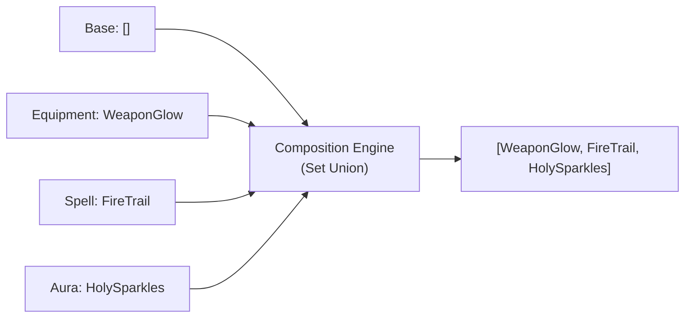

The consumer (e.g. a renderer) reads only the effective resource list. It has no dependency on which capability contributed which entry.

### Animation, Skeleton, and Material Composition

Animation, skinning, and materials are not special-cased mechanisms — they are ordinary resource properties composed with the strategies above.

- **Animation selection** typically uses **Priority Override**: a `Stunned` contribution outranks `Combat`, which outranks `Movement`, which outranks the `Idle` base.
- **Animation blending** (a walk/run blend, an upper-body aim layer, a facial expression layer) uses **Weighted Composition** or **layered** composition, where each layer resolves independently and layers combine in a defined order.
- **Skeleton composition** uses **Ordered Composition**: a base `HumanoidSkeleton` extended with an `ArmorSkeletonExtension` contributing additional bones.
- **Skin and material composition** uses **Ordered Composition**: a base texture layered with tattoo, armor, damage-overlay, wetness, or glow contributions, each capability-owned and mutually unaware of the others.

```mermaid
flowchart TD
    subgraph Layers["AnimationPose — Layered Composition"]
        L1["Base Layer: Walk"]
        L2["Upper Body Layer: Aim Weapon"]
        L3["Facial Layer: Smile"]
        L4["Override Layer: Hit Reaction"]
    end
    Layers --> Pose["Final Composed Pose"]
```

No animation-specific or material-specific mechanism exists in the runtime. A capability author reaches for the same composition strategies whether contributing gameplay state or visual state — consistent with §1's assertion that Atlas provides mechanisms, and applications provide meaning.

### Audio Composition

Audio uses the identical mechanism: an `ActiveAudioSources` property accumulates contributions (environment, equipment, ability effects) into a mixed audio graph, the same way `ParticleEffects` accumulates into a render list.

### Contribution Lifetime

A contribution carries an explicit lifetime, independent of the composition strategy:

- **Permanent** — remains until explicitly removed
- **Duration** — expires after a fixed time
- **Until Event** — removed when a specified event occurs
- **While Condition Exists** — tied to an external condition (e.g. an aura remains only while its source entity is alive)

Lifetime is evaluated using Atlas's deterministic time (§4, Built-in Deterministic Types) when the property participates in simulation, keeping duration-based contributions reproducible under replay the same as any other simulation state.

### Request Validation and Presentation-Only Properties

Whether a property's *type* is subject to Request Validation (§6) depends on what it represents:

- **Gameplay-affecting properties** (e.g. `MovementSpeed`, `Health`, `Armor`) are mutated through ordinary requests, validated and subject to rejection exactly as described in §6. An aura contributing `MovementSpeed ×0.5` is, mechanically, a request like any other — it can be rejected if the issuing source lacks authority or the contribution is invalid.
- **Presentation-only properties** (e.g. `CurrentAnimation`, `ParticleEffects`, `MaterialLayers`, camera effects) are not simulation state, and follow the same presentation-only boundary already defined for the Lua UI layer (§19, Request Boundary) and for rendering/audio (§4, Deterministic Execution): the property itself is never rejected, and has no effect on authoritative state or replay correctness.

This split is a property of the property's own contract — declared once, when the property is defined — not a judgment call made at each contribution site.

**Presentation-only does not mean unconditional.** A contribution to a presentation-only property is commonly the *consequence* of a request outcome rather than an input to one — and where that's the case, the contribution must be made only after the triggering request has been validated and accepted, never speculatively in advance of that outcome. A capability must not contribute presentation state on the strength of a request it has only issued, not yet had confirmed — doing so presents an outcome to the player that the server may still reject.

Concretely: a client issuing a request does not contribute to `CurrentAnimation` or `ParticleEffects` locally in anticipation of that request succeeding. The contribution is made once, by whichever host is authoritative for the decision the presentation depends on, as part of that request's accepted handling — and reaches other hosts through ordinary replication, the same as any other effect of a validated request. This is a stricter reading of §6 (Server Authority) than "presentation is exempt from validation": presentation is exempt from being *itself* rejectable, but it is not exempt from depending on a decision that was validated.

### Runtime Representation

A contribution and its resolved output are ordinary, reflected data structures:

```cpp
// property_composition.hpp

template <atlas::Composable P>
struct PropertyContribution {
    atlas::PropertyId<P> property;
    atlas::SourceId      source;
    typename P::ValueType value;
    atlas::Priority       priority;
    atlas::Lifetime        lifetime;
};

template <atlas::Composable P>
struct EffectiveProperty {
    atlas::PropertyId<P> id;
    typename P::ValueType value;
};

// Reading an effective value uses the same typed, monadic context
// API as any other property access (§20, and see §21's ctx.get<T>()):
//
//   ctx.get<MovementSpeed>(entity)
//      .as_float()
//      .or_else([] { return MovementSpeed::default_value(); });
```

### Networking and Replication

Property replication follows one categorical rule based on which capability produced the property:

**UI capability properties are never replicated.** A property declared by any UI capability (`atlas-ui`, `player_ui_layout`, or any capability in the game's own `ui/` layer) exists only on the client host that composes it. It has no server-side concept — not because the server ignores it, but because the server never composes the capability that declares it, so the property simply does not exist in the server's composition. UI layout, panel positions, action bar assignments, color overrides, and widget state are all client-local by definition.

**All other properties may be replicated.** Whether a non-UI property is replicated, and how, is declared per property. Two replication strategies are available:

| Strategy | Use case |
|---|---|
| **Replicate contributions** | Clients need to reproduce the composed result themselves (e.g. for client-side prediction, §6) |
| **Replicate effective value** | Simple presentation state where only the final result matters (e.g. `CurrentAnimation = Attack01`) |

The replication strategy is part of the property's definition, following the same "the property declares its own rules" pattern as composition strategy and request-validation applicability above.

The categorical UI boundary also resolves resource loading: UI resource IDs (icons, textures, fonts) are only ever resolved by client hosts, since only client hosts compose the UI capabilities that reference them. Server hosts never encounter UI resource IDs — not by filtering them out, but because the capabilities that reference them are simply absent from the server's composition (§3, Resource).

### Tooling Support

Because contributions and composition strategies are reflected (§14, Generated Contracts), tooling can display a property's full derivation without any property-specific tooling code:

```
MovementSpeed
  Base:          7
  Boots:         +10%
  Mud:           ×0.5
  Slow:          ×0.7
  Final:         2.695

Current Effects (ParticleEffects)
  Sources: Fire Aura, Weapon Glow, Zone Effect
```

This is generic across every composed property — an editor or debugger built against the composition contract works for `MovementSpeed`, `CurrentAnimation`, or any future composed property without modification, consistent with §18 (Editor Extensions: generic editing through reflection).

### Design Rule

A capability must not directly modify another capability's state. Contribution is the only channel:

```mermaid
flowchart LR
    A["Capability A"] -->|"creates contribution"| PC["Property Composition"]
    PC -->|"effective value"| B["Capability B"]
```

Capability A contributes; it never reaches into Capability B's state directly. Capability B consumes the effective value; it never needs to know who contributed to it. This is the same isolation principle already established in §4 (Capability Isolation) and §5 (Tiny Interface Composability), applied to the specific case of multiple capabilities converging on one value.

---

## 21. Worked Example

This section walks through a minimal capability and its composition into a host, to make the preceding architectural definitions concrete.

The example defines a single capability, `health`, with one entity property, one request, and one event. It is then composed into a server host and a client host to show how the same capability behaves under each host's authority model.

> **Note on scope:** this example is illustrative pseudocode, not a literal Atlas API surface. It is meant to show how the concepts in §1–§18 compose in practice, not to prescribe exact declaration syntax.

### Defining the Capability

A capability's structure — properties, requests, events, and dependencies — is authored declaratively (§14, Declarative Source Format), not hand-written as C++. Like `health-ui-bridge` in §19, this example is abbreviated (§13, Capability Manifest) to the structural fields; a real manifest also carries `version`, `source`, and `contracts`:

```yaml
capability:
  name: health
depends_on: [entity]

properties:
  Health:
    current: int32
    maximum: int32

requests:
  ApplyDamage:
    target: EntityRef
    amount: int32

events:
  HealthChanged:
    target: EntityRef
    new_current: int32
```

This is pure structure — no logic, per the Declarative Boundary (§14). Atlas tooling validates it (request signature, property types, dependency on the entity capability already existing at a lower level — §5) and **generates** the corresponding C++ contract:

```cpp
// GENERATED — health.capability.hpp
// Source: health.capability.yaml — do not hand-edit.

namespace atlas::health {

struct Health {
    std::int32_t current;
    std::int32_t maximum;
};
static_assert(atlas::PropertyContract<Health>);

struct ApplyDamage {
    atlas::EntityRef target;
    std::int32_t     amount;
};
static_assert(atlas::RequestContract<ApplyDamage>);

struct HealthChanged {
    atlas::EntityRef target;
    std::int32_t     new_current;
};
static_assert(atlas::EventContract<HealthChanged>);

static_assert(atlas::DependsOn<atlas::capabilities::entity>);

}  // namespace atlas::health
```

The generated contract provides a typed accessor for the `Health` property, a typed dispatch signature for `ApplyDamage`, and a typed publish/subscribe signature for `HealthChanged`. No algorithm lives in the generated contract — only structure (§14).

### Implementing Behavior

The capability author writes the manual implementation the contract describes (§14, Manual Implementation) — this part is always hand-written C++, never declarative, because it is behavior. It uses the typed context API — `ctx.get<T>()` returns a monadic result rather than a raw pointer or a throwing accessor, so absence and authority are handled explicitly rather than by convention:

```cpp
// health.cpp — hand-written, not generated

atlas::RequestResult on_request(atlas::Context& ctx, const ApplyDamage& cmd)
{
    // Request Validation (§6): reject if the request is invalid
    // for current authoritative state.
    if (!ctx.host().has_authority()) {
        return atlas::reject(cmd, "not authoritative");
    }

    return ctx.get<Health>(cmd.target)
        .or_else([&] { return atlas::reject(cmd, "target has no Health"); })
        .and_then([&](Health& health) -> atlas::RequestResult {
            health.current = std::clamp(health.current - cmd.amount,
                                         0, health.maximum);

            ctx.publish<HealthChanged>({
                .target      = cmd.target,
                .new_current = health.current,
            });

            return atlas::accept(cmd);
        });
}
```

This logic is ordinary application code. Atlas never inspects what "damage" or "health" mean (§2, Mechanism Over Meaning) — it only provides the deterministic mechanisms (property storage, request dispatch, event delivery) that let this code run identically wherever it is composed.

### Composing Hosts

Host composition is declared the same way as capability structure (§14, Declarative Source Format) — data, not hand-written C++:

```yaml
host: DedicatedServer
composes: [entity, health, replication, networking_server]
---
host: GameplayClient
composes: [entity, health, replication, networking_client]
---
host: Editor
composes: [entity, health, editor_inspector]
```

```mermaid
flowchart TB
    Health["health capability<br/>(same contract + implementation)"]

    Health --> Server["Dedicated Server Host<br/>entity + health + replication + networking-server"]
    Health --> Client["Gameplay Client Host<br/>entity + health + replication + networking-client"]
    Health --> Editor["Editor Host<br/>entity + health + editor-inspector"]

    Server -->|"authoritative mutation"| ServerBehavior["ApplyDamage applied directly"]
    Client -->|"no authority"| ClientBehavior["ApplyDamage predicted, reconciled on mismatch"]
    Editor -->|"reflection metadata"| EditorBehavior["Generic property editing, zero extra code"]
```

**Server host** — a dedicated server host links `health` alongside the capabilities that give it authority and network exposure. `ApplyDamage` requests arrive from connected clients over `networking-server`, are routed to `health`'s request handler, validated, and — if accepted — mutate authoritative `Health` state and publish `HealthChanged`, which `replication` then distributes to observing clients (§6, Server Authority).

**Client host** — a gameplay client host links the same `health` capability, without authority. The client's `health` capability is the same generated contract and the same manual implementation. The only difference is host composition: the client host does not compose an authority-granting capability, so `host.hasAuthority()` is false, and any locally-issued `ApplyDamage` is either not attempted or is treated as a local prediction pending server confirmation (§6, Request Validation and Reconciliation) — reconciled if the server later rejects it or produces a different `HealthChanged` outcome.

**Editor host** — an editor host composing `health` gains generic property editing for `Health` automatically, through generated reflection metadata (§18): no editor-specific code is required unless the capability author chooses to add a custom inspector.

### What This Illustrates

- The same capability (`health`) is compiled once and linked into three different hosts without modification (§4, Capability Isolation).
- Authority (§6) is a property of the host composition, not of the capability: the identical `ApplyDamage` handler behaves as authoritative mutation on the server and as prediction-pending-confirmation on the client.
- The contract (typed `Health`, `ApplyDamage`, `HealthChanged`) is the stable boundary every host composition depends on; only the manual implementation and the composing host differ.
- Reflection (§18) means the editor host required zero additional code to gain basic editing of `Health` — generic editing came from the contract alone.

---

## 22. Incremental Compilation

Atlas encourages small, reusable libraries. When application code changes:

- affected capability libraries are rebuilt
- generated contracts are regenerated when required
- affected hosts are relinked

The build system can determine the smallest affected dependency set because capabilities and contracts have explicit boundaries.

### Editor Incremental Builds

The editor is not a privileged application. The editor is another Atlas host composed from reusable libraries.

When gameplay code changes:

- gameplay libraries are rebuilt
- affected contracts are regenerated
- the gameplay client is relinked
- the editor is relinked only when affected dependencies change

Atlas runtime libraries remain unchanged. This minimizes incremental build times.

### Independent Evolution

Runtime libraries, gameplay libraries, editor libraries, and tooling evolve independently while remaining connected through stable public contracts. A change in one layer should not require rebuilding unrelated layers.

---

## 23. Platform Architecture

Atlas is organized as a layered platform.

```mermaid
flowchart TD
    subgraph L1["Applications"]
        A1["Client"]
        A2["Server"]
        A3["Editor"]
        A4["Tools"]
        A5["Tests"]
    end
    subgraph L2["Capability Libraries"]
        B1["Gameplay"]
        B2["Editor Extensions"]
        B3["Domain Behavior"]
    end
    subgraph L3["Generated Contracts"]
        C1["Reflection"]
        C2["Serialization"]
        C3["Metadata"]
        C4["Documentation"]
    end
    subgraph L4["Runtime Libraries"]
        D1["Scheduling"]
        D2["Entities"]
        D3["Replication"]
        D4["Resources"]
    end
    subgraph L5["Platform Services"]
    end

    L1 --> L2 --> L3 --> L4 --> L5
```

Every Atlas application is created by composing these layers. Only the application layer defines domain meaning.

---

## 24. Non-Goals

Atlas intentionally does not prescribe:

- gameplay architecture
- rendering technology
- physics implementation
- ECS storage model
- scripting language *(Atlas does not prescribe a scripting language; Lua appears only as part of the optional WotLK addon compatibility capability, §19)*
- content pipeline
- game rules
- application-specific workflows

Atlas provides mechanisms for building applications. Applications remain free to choose their own semantics and implementation strategies.

Atlas intentionally does not define a UI framework in the traditional sense. It provides a minimum UI contract — a bindable property tree, resource references, input events, and composition — that any backend may render. See §19 (UI System) for the full design.

**Cross-machine UI layout synchronization is explicitly out of scope.** UI layout state (panel positions, action bar assignments, color overrides) is client-local — it is a function of which capabilities and addons are installed on that specific client, and that composition is not known to or tracked by the server. A separate capability may persist and restore layout state locally; synchronizing it across machines would require the server to track per-client UI state at a cost inconsistent with the platform's scaling goals (§7, Host Composition).

---

## 25. Compatibility Philosophy

Atlas exposes stable public interfaces. The supported integration boundary is defined by:

- contracts
- generated metadata
- public library interfaces

Implementation details remain free to evolve.

### Contract Evolution

Generated artifacts may change between Atlas versions. However, contracts should evolve in a controlled manner. Where practical:

- existing integrations remain valid
- incompatible changes are explicit
- migration paths are provided

### Implementation Freedom

Internal implementations may change without affecting applications. For example:

- scheduler internals may change
- storage mechanisms may change
- serialization implementations may change
- editor implementations may change

as long as public contracts remain compatible.

---

## 26. Design Principle

Every Atlas host is built from reusable libraries. The editor is not a privileged application — it is another Atlas client.

Because every host shares generated contracts and runtime libraries, Atlas minimizes duplicated infrastructure while allowing each host to compose capabilities appropriate to its purpose.

Gameplay libraries, editor libraries, runtime libraries, and tooling evolve independently while remaining connected through stable public contracts.

The most significant consequence of this design is that "engine," "editor," "server," "previewer," and "test harness" stop being different applications with separate behavior and failure modes. They become different configurations of the same runtime. A bug that exists in the game exists in the preview tool; a result confirmed in the preview tool is a real result. An AI tool that edits capability data — adding a sound layer, adjusting a composition condition, modifying a property — immediately produces a result that can be previewed against the actual runtime, without a separate engine build or editor reimplementation (§9, Capability Isolation and Previewing).

### Composition Over Deployment

Atlas separates architecture from deployment.

- Composition defines behavior.
- Deployment defines location.

A host may execute:

- alone in a process
- alongside other hosts in the same process
- on another machine
- inside a testing environment

without changing its architectural identity.

A standalone multiplayer game containing both a server host and a client host is the same architectural model as a distributed server-client deployment. The difference is only where execution occurs.

### Final Principle

Atlas is a platform whose architecture is defined by:

- compile-time composition
- deterministic execution
- stable contracts
- generated reflection
- reusable capabilities
- deployment-independent hosts

Every Atlas application — whether a gameplay client, dedicated server, editor, automation tool, or embedded simulation — is built from the same foundational model.

> Atlas defines execution. Capabilities define behavior. Applications define meaning.
