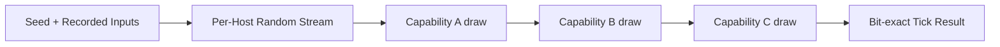

## 4. Architectural Invariants

Every Atlas application follows the same architectural rules. These rules define the boundaries of the platform.

### Runtime Independence

The runtime never depends on capabilities. The runtime provides mechanisms but never knows application semantics.

### Capability Isolation

- Capabilities never depend on applications.
- Applications compose capabilities.
- Capabilities remain reusable across different applications and hosts.

### Compile-Time Composition

All capability composition occurs during compilation. Runtime discovery of capabilities is not part of the Atlas architecture.

### Generated Contract Ownership

Generated code depends only on public contracts. Generated artifacts do not contain application logic.

### Shared Execution Model

All hosts execute the same runtime model. A server, client, editor, or automation tool differs only through composition.

### Reflection Consistency

Public structures are represented through generated reflection metadata. Reflection data is generated rather than manually maintained.

### Deterministic Execution

Atlas guarantees **bit-exact determinism**. Given identical inputs, a host produces identical outputs, down to the bit, on every execution.

This guarantee holds:

- across repeated runs on the same machine
- across different machines of the same target platform
- across a full session replay from a recorded input stream

Bit-exact determinism is required to support:

- lockstep networking
- authoritative replay
- rollback and resimulation

Sources of non-determinism are architectural defects, not acceptable variance. Atlas tooling and runtime libraries are responsible for eliminating common sources of non-determinism, including:

- unordered iteration over concurrent or parallel work
- floating-point operations that vary by platform or instruction set
- uninitialized memory
- wall-clock time or other non-reproducible external input used directly in simulation logic

Anything that must vary by platform (rendering, audio, non-simulation timing) is explicitly excluded from the deterministic boundary and must not influence simulation state.

Scheduling and execution order are controlled by Atlas systems rather than accidental implementation details. A fixed, reproducible stage and job order is part of the determinism guarantee, not merely an optimization.

#### Built-in Deterministic Types: Random and Time

Capabilities that require randomness or time must source it from runtime-provided, built-in deterministic types rather than platform or language facilities.

**Random**

Atlas provides a built-in deterministic random type. It is seeded explicitly, produces an identical sequence of values for a given seed on every platform, and is the only permitted source of randomness within simulation logic.

Capabilities must not read from platform entropy sources (OS random number generators, hardware RNG, uninitialized memory, or similar) directly. Doing so is a violation of the determinism guarantee.

**Time**

Atlas provides a built-in deterministic time type representing simulation time. Simulation time advances only through the runtime's scheduling and stage execution, never by reading wall-clock time directly.

Capabilities must not read platform wall-clock time (OS clock, high resolution timers, or similar) within simulation logic. Presentation-only concerns (e.g. audio, rendering interpolation) may use wall-clock time, but that time must not feed back into simulation state.

**Replay and Reproducibility**

Because random and time are both built-in, runtime-owned types rather than ambient platform state, a recorded input stream together with an initial random seed is sufficient to reproduce a session bit-exactly. Nothing outside the recorded inputs and the seeded random stream can influence simulation outcome.

The random stream is scoped **per host**: a single seeded stream is shared by every capability composed into that host, consumed in the same fixed order the deterministic scheduler already guarantees.

A replay is only valid against the host composition it was recorded with. This follows directly from determinism, not as a separate rule: changing which capabilities are composed into a host changes what that host's tick does, the same way replacing a physics engine would. Reproducibility guarantees identical output for identical composition and identical input — it does not guarantee identical output across a changed composition.
