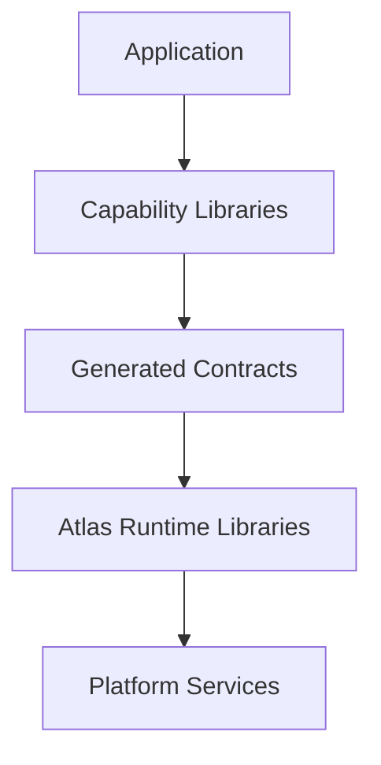
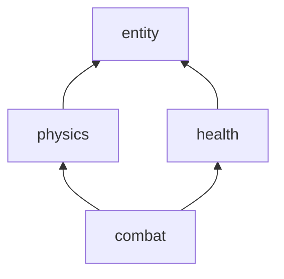
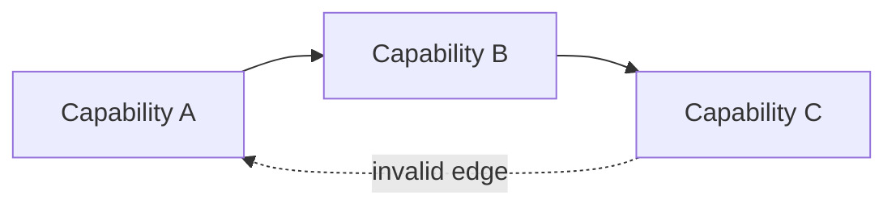
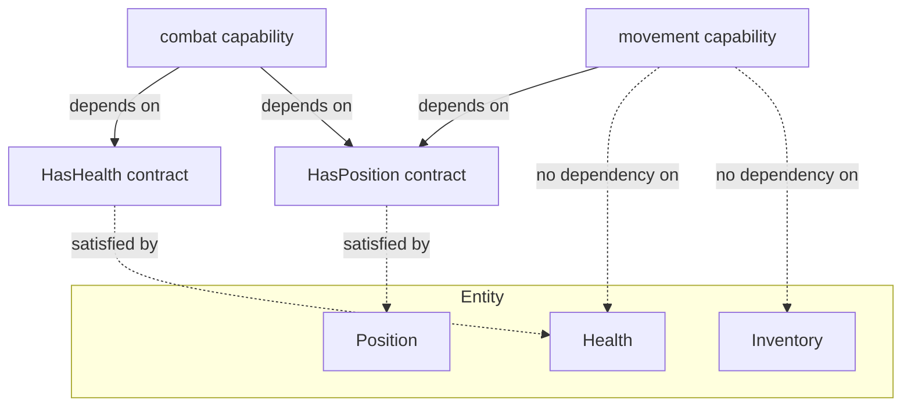

## 5. Dependency Model

Atlas dependencies always point toward lower architectural layers. No layer may depend upward.



This dependency model minimizes coupling while maximizing reuse.

### Dependency Rules

The following rules define valid dependencies:

**Applications** may depend on:
- capabilities
- generated contracts
- runtime libraries
- platform services

Applications define final composition.

**Capabilities** may depend on:
- lower-level capabilities
- generated contracts
- runtime libraries

Capabilities may **not** depend on:
- applications
- editor implementations
- deployment-specific code

**Runtime libraries** may depend on:
- lower-level runtime libraries
- platform services

Runtime libraries may **not** depend on:
- capabilities
- applications
- editor features

**Generated artifacts** may depend only on:
- public contracts
- schema definitions
- metadata generators

Generated artifacts do not contain:
- application behavior
- runtime implementation
- deployment logic

### Capability Dependency Ordering

Capability ordering is derived entirely from the dependency graph. There is no separate tier, layer number, or category assigned to a capability.

A capability declares the capabilities it depends on. Atlas tooling constructs a directed graph from these declarations. A capability is "lower-level" than another purely because the other depends on it, directly or transitively.

This graph is the sole source of ordering truth. No naming convention, folder location, or manual tier assignment participates in validation.



*Combat depends on health and physics; health and physics both depend on entity. Ordering is read bottom-to-top from the graph alone.*

#### Cycle Detection

A dependency cycle is an invalid composition.

If capability A depends, directly or transitively, on capability B, and B also depends, directly or transitively, on A, Atlas tooling fails the build.



*A → B → C → A forms a cycle. This composition fails to build.*

The build failure is a hard compile-time error. Atlas tooling reports the full dependency chain that forms the cycle, in order, so the offending edge can be identified without manual graph tracing. For the example above, the tooling output identifies all three edges in the chain, not just the first offending dependency encountered.

This is consistent with the existing invariant that composition decisions, including validation of the dependency graph, occur entirely at compile time. Runtime discovery or runtime resolution of capability order is not part of the Atlas architecture.

### Tiny Interface Composability

Capabilities compose through small, single-purpose contracts rather than large, monolithic ones. A capability satisfies the specific contracts relevant to it; it does not inherit or implement a broad interface it only partially needs.

This mirrors structural interface composition found in languages like Go: a type there doesn't declare "I implement interface X" — it simply has the right methods, and satisfies any interface that asks for them. Atlas applies the same idea to properties and resources, at compile time, with zero runtime cost.

**Properties.** A property contract describes one narrow piece of structure — not "this is an Entity," but "this has a `Health`," or "this has a `Position`." A capability that only needs to read an entity's `Position` depends on a `HasPosition`-shaped contract, not on the entity's full property set. Two unrelated capabilities can each compose against the same small property contract without depending on each other, or on anything else the entity happens to carry.

**Resources.** The same principle applies to resources (§3, Resource). A capability that needs to load a texture depends on a `Loadable<Texture>`-shaped resource contract, not on the full resource system or on how a specific resource type is authored, versioned, or resolved. A resource that satisfies several small contracts (loadable, hot-reloadable, streamable) does so independently for each — a capability using it only for loading has no dependency on streaming.

**Location independence.** Where a property or resource is actually stored, executed, or resolved — locally, replicated from a server, resolved from disk, streamed — is a runtime and host concern (§6, §7), not a contract concern. The same tiny contract is satisfied whether the underlying implementation executes on a server host, a client host, or in a standalone test harness. A capability written against `HasPosition` does not change based on whether `Position` happens to be authoritative on this host or replicated onto it. This is the same principle §21 (Worked Example) already demonstrates for request-handling logic — identical capability logic, different host, different execution context — generalized to properties and resources as well.

**Compile-time, zero-cost satisfaction.** Contract satisfaction is resolved entirely at compile time. A capability's tiny contracts, and the metadata describing them, are built as `constexpr` data — not generated as a runtime-inspected schema that is merely produced by the build. This means:

- whether a given entity or resource satisfies a contract is a compile-time fact, checked the same way a C++ concept constraint is checked
- there is no runtime interface table, no virtual dispatch, and no runtime lookup cost for determining whether a contract is satisfied
- invalid composition (a capability depending on a contract nothing provides) is a compile error, consistent with §4 (Compile-Time Composition) and §12 (Compile-Time Validation), not a runtime failure



*`movement` depends only on `HasPosition`. It has no dependency on `Health` or `Inventory`, even though all three properties may exist on the same entity. `combat` composes two small contracts rather than depending on the whole entity.*

This keeps capabilities reusable in the way §4 (Capability Isolation) already requires, but extends the principle from "capabilities don't depend on applications" down to "capabilities don't depend on more structure than they actually use." A capability's dependency footprint reflects exactly the properties and resources it touches — nothing more.

### Ordering Without Stages

Execution order between capabilities is determined entirely by the dependency graph described above. There is no separate stage, phase, or system-registration concept through which a capability declares *when* it runs, alongside or instead of *what it depends on*.

This includes ordering concerns that might otherwise look like they need a distinct "phase" mechanism — most notably, the requirement that presentation output (rendering, audio) is derived only from simulation state that has already reached its final value for the tick (§4, Deterministic Execution). This does not require a capability, or a renderer, to register into a phase. It falls out of ordinary dependency:

- A presentation-only property (§20, Command Validation and Presentation-Only Properties) is contributed to only as the consequence of an already-validated request, by the capability handling that request.
- A renderer or audio system depends — in the ordinary §5 sense — on the presentation-property contracts it reads (`CurrentAnimation`, `ParticleEffects`, `ActiveAudioSources`), not on every gameplay capability that might contribute to them.
- Because the contributing capabilities are, transitively, lower in the dependency graph than the presentation properties they populate, and the renderer depends on those properties, the graph alone places the renderer after every contribution has been made for the tick — with no additional ordering concept required.

The runtime still executes in a fixed, deterministic sequence internally (§4, Deterministic Execution; `atlas-stage`, §13, Library Responsibilities) — determinism does not depend on capabilities being aware of that sequence or declaring themselves into it. A capability's only ordering input is what it depends on.

### Property-Level Ordering (Provides/Consumes)

"Ordering Without Stages" above derives capability ordering from `depends_on` — a capability names the *capabilities* it depends on. That is sufficient for structural dependencies (a capability needing another's generated contract to compile against), but it over-couples ordering: a capability that only cares about a property's *value* still has to name whichever capability happens to provide it.

A capability may instead declare `consumes:` — a list of *property names*, not capability names:

```yaml
capability:
  name: cast_time_attack
depends_on: [entity, attack_resolution, movement, interruption, resource]
consumes: [CastSpeed]
```

Atlas tooling resolves each consumed property name against whichever composed capability's own `properties:` block declares it, deriving a "consumer depends on provider" edge automatically — the consumer's manifest never names the provider. This is the same "systems coupled to data, not implementation" principle Tiny Interface Composability already applies to entity/resource structure, extended to ordering itself: a capability's dependency footprint reflects the properties it actually reads, not which other capability happens to compute them today.

Provides/consumes edges are merged with explicit `depends_on` edges into the same graph before cycle detection and ordering (above) run — a property-driven cycle is reported with the same full-chain diagnostic as a `depends_on` cycle. Two validation rules apply, checked at compile time like any other composition fact (§12, Compile-Time Validation):

- **Every consumed property must have a provider among the composed set.** A capability consuming a property nothing composed provides is a build failure, not a runtime lookup that might come back empty.
- **A property has exactly one provider.** Two composed capabilities declaring the same property name is a build failure naming both offending capabilities — ambiguity about which capability is authoritative for a property is not a runtime precedence rule to resolve, it is an invalid composition.

This is a distinct concern from property *composition* (§20): composition is how several capabilities' independent *contributions* combine into one property's value once a single provider already exists to hold it. Provides/consumes is about which one capability is responsible for computing that property's value in the first place. A property can need both: a single provider capability whose computation internally resolves multiple contributions via a composition strategy.

The graph has no reverse edges chosen at runtime. A UI affordance that feels bidirectional — dragging a derived value and having it "solve back" for whichever authored parameter produced it — is not a property gaining a second, opposite edge; it is multiple distinct forward-only requests (e.g. `SetTurnRadiusHoldingSpeed`, `SetTurnRadiusHoldingBank`, alongside a plain `SetSpeedAndBank`), each performing its own validated inverse computation and writing back to the same authored properties every other request writes to. Which value is source-of-truth and which is derived is fixed once, by the manifest's provides/consumes declarations — never decided at runtime by which widget a user happens to be interacting with.

The resulting graph — properties and capabilities as nodes, `provides`/`consumes`/`depends_on` as edges — is what the scheduler described in §4 (Tick Execution) traverses each tick to decide which nodes are ready.

### Input as Intent

Raw platform input (key presses, mouse buttons, controller axes) never crosses into capability code. `atlas-input` (§13, Library Responsibilities) reads raw device state once per tick, resolves it against the current binding configuration, and produces `Intent` events — semantic, player-authored actions (`CastAbility`, `Interact`, `MoveForward`) — into the same batch/stage pipeline every other event uses.

```yaml
# atlas-input produces (game-declared intent vocabulary, not a fixed platform list):
events:
  Intent:
    kind: IntentId         # e.g. Interact, MoveForward, PrimaryAction
    entity: EntityRef
    axis: optional<Vec2>   # for continuous intents (movement direction, camera)
```

Binding configuration is data, not code — which key maps to which intent is authored as a binding config file, player-editable at runtime (no recompile, live rebind). A capability author never has access to "was E pressed" — only "did the player express this intent."

The `Intent` event from a player pressing a key and the `Intent` event from a Lua addon's valid macro (§19, Request Boundary) are the same type, produced by the same pipeline. The capabilities consuming them cannot and need not distinguish their origin.

`atlas-input` sits below any capability that needs player intention in the dependency graph — a movement capability depends on `atlas-input`, not on any platform-specific input concept. Because the dependency graph determines ordering (§5, Ordering Without Stages), input processing is guaranteed to precede the simulation systems that consume it, without any explicit stage declaration.
