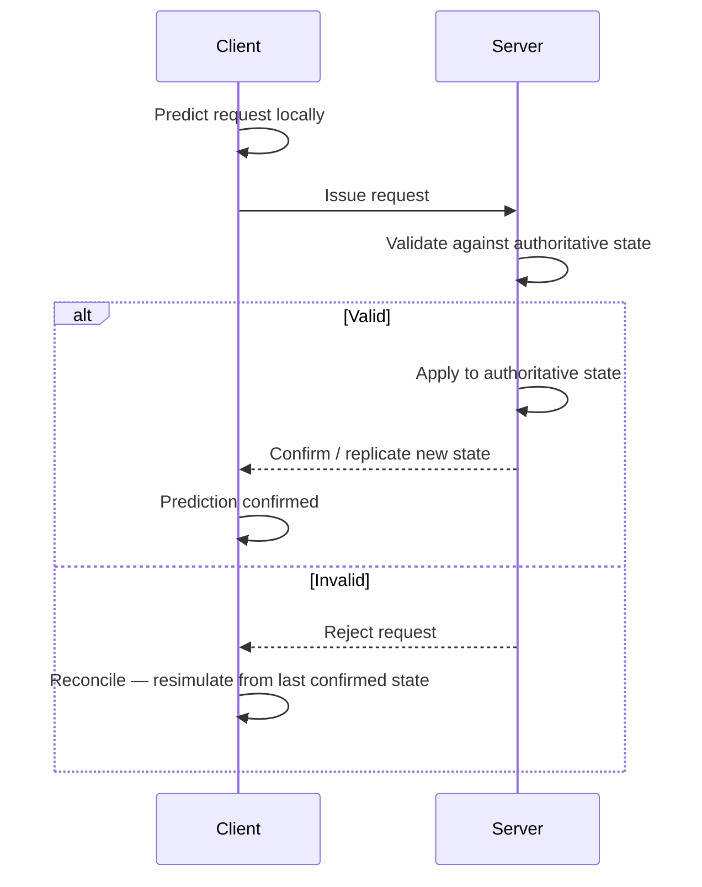
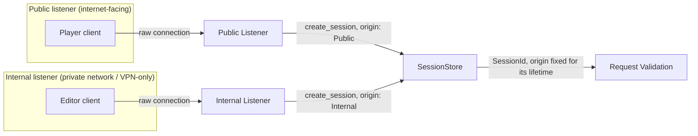
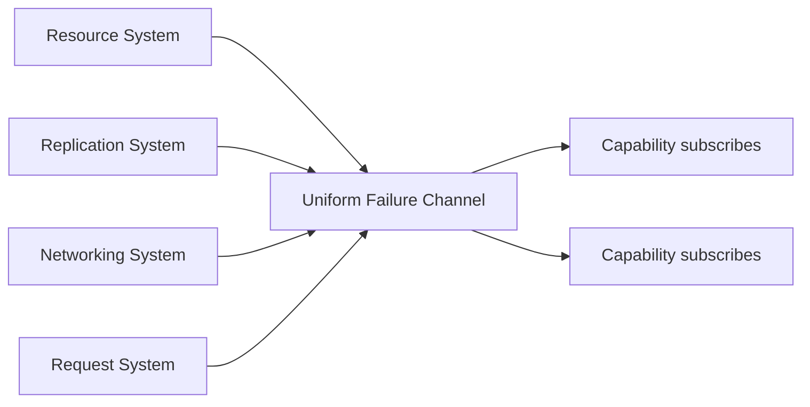
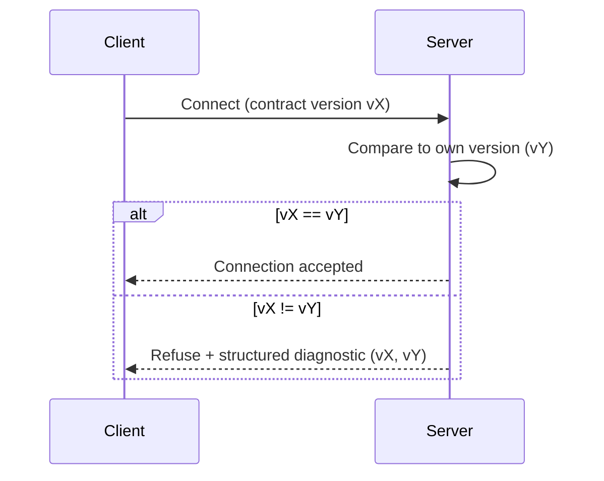

## 6. Server Authority

Atlas is server authoritative.

- Authoritative simulation executes on server hosts.
- Client hosts observe replicated state and issue requests.
- Replication distributes observable state from authoritative hosts.
- Authority is a responsibility of hosts rather than capabilities.

Capabilities remain independent of deployment topology and may execute within:

- server hosts
- client hosts
- editor hosts
- testing hosts
- other host compositions

without modification.

> A capability defines behavior. A host defines authority.

### Terminology: Request vs. Internal Dispatch

Atlas has one dispatchable contract kind: the **request** (§14, declared under a capability's `requests:` block, generated as a `RequestContract`). "Command" is not a separate schema concept — it describes a specific *origin*, not a different technical mechanism.

- A request **issued by a client** originates at the boundary between a client host and an authoritative host, crosses that boundary, is subject to validation and rejection (below), and may be predicted and reconciled (§6, Request Validation and Reconciliation).
- A request **dispatched internally** — one capability calling into another capability's request contract as part of handling its own work — never crosses the client/server boundary and was never issued by a client. This document calls such an internal dispatch a **command** as a matter of description, to keep prose about "what a capability does with an already-validated request" readable — but it is the same `RequestContract` mechanism, invoked from within a handler rather than from across the network.

An internal command is not itself subject to Request Validation — it inherits whatever validation the client-issued request that triggered it already passed. A client-issued request commonly results in one or more internal commands once it is accepted — but the request is the thing a client sent and a server decided on; the internal commands are how the server's own capabilities then carry that decision out, using the same dispatch mechanism, just invoked from code rather than from across the network.

### Request Validation and Reconciliation

Clients issue requests. A request is not a guaranteed state change — it is honored only if the server validates it.

The server validates every incoming request against authoritative state before applying it. If a request is invalid — because it conflicts with current authoritative state, fails a capability-defined precondition, or is not permitted for the issuing client — the server rejects the request. The server never silently mutates a client's request to make it valid.



Validation and application both happen at a tick boundary (§4, Tick Execution), never instantly at the moment a request arrives. Every request received since the previous tick accumulates into that tick's input batch and is processed in a fixed deterministic order — never applied early because an application considers it latency-sensitive, and never delayed relative to other requests in the same batch. A constant, predictable per-tick delay is preferable to variable per-request latency: jitter in *when* a request takes effect is a worse experience than a small, fixed delay every request equally incurs, and — more fundamentally — an "instant path" that bypasses the tick boundary would be a second, ad hoc execution order existing alongside the one the dependency graph already defines, which is exactly what Deterministic Execution (§4) rules out.

A rejected request is not applied to authoritative state. The server communicates rejection back to the originating client through the normal contract boundary (requests, events, or replicated state, as appropriate to the capability).

The client is responsible for reconciliation. Because Atlas guarantees bit-exact determinism, a client capability may predict the outcome of a request locally before server confirmation, then reconcile by resimulating from the last confirmed authoritative state if the server's outcome differs from the local prediction.

Reconciliation is a **capability** concern, not a runtime concern. The runtime provides the deterministic execution and replay mechanisms that make reconciliation possible (fixed stage ordering, deterministic resimulation from a known state). Capabilities decide whether and how to predict, and how to resolve a mismatch (e.g., snap, blend, or replay).

This preserves the existing invariant: authority is a responsibility of hosts, and capabilities remain unaware of deployment topology. A capability that predicts locally behaves identically whether it happens to run on a client host reconciling against a remote server or a host running standalone against its own authoritative state.

### Request Trust and Permission

Atlas does not enforce who is permitted to issue a given request. The runtime's responsibility ends at delivery: it routes a request from its origin to the capability that defines it, deterministically and reliably. Whether that request should be honored is a decision the capability makes.

This follows directly from Mechanism Over Meaning (§2). "Who may open this door" or "who may cast this spell" is application semantics, not execution mechanics. Atlas has no concept of a player, a role, or a permission — those concepts belong to capabilities, the same way health and inventories do.

What the runtime does provide is **origin information**: a request arrives with enough identity/origin metadata (which connection, which client, which host) for a capability to make a trust decision. Atlas guarantees this metadata is authentic — a capability can trust that a request claiming to originate from connection X actually did — but Atlas does not interpret it.

Capabilities are responsible for defining and enforcing their own permission model on top of this origin metadata: for example, verifying that the issuing client owns the entity a request targets, or that a request is only valid from a client currently in a particular game state. This is validated as part of the same Request Validation step described above — an unauthorized request is simply an invalid request, and is rejected the same way a request that violates game-state preconditions is rejected.

> Atlas provides no default permission model. A capability that defines no trust policy accepts requests from any origin.

### Session Identity

The origin metadata described above (Request Trust and Permission) is backed by a concrete mechanism: `atlas-session` (§13, Library Responsibilities). A session is established the moment a connection begins and identifies one connected client distinctly from any other — including two clients running on the same physical machine, which never share a session. A session is not an account, a credential, or a player; it is the minimal identity a capability needs in order to ask "did this same origin send me a previous request."

**`SessionId`** is a vocabulary type, used as a request field exactly the way `EntityRef` (§3) and `ResourceId` (§3) already are:

```yaml
capability:
  name: inventory
depends_on: [entity, session]

requests:
  MoveItem:
    session: SessionId
    from_slot: int32
    to_slot: int32
```

A capability that declares a `SessionId`-typed field depends on `session` the same way one declaring an `EntityRef` field depends on `entity` — an ordinary `depends_on` edge (§5, Capability Dependency Ordering), not a new kind of dependency.

**`SessionStore`** is the tiny, backend-swappable contract (§5, Tiny Interface Composability) that creates, validates, and revokes sessions. Location independence (§5, Tiny Interface Composability: "Location independence") applies here exactly as it does to properties and resources: whether sessions live in a single process's memory or a store shared across many server processes — for example, sharded per world — is a deployment decision, never a contract concern. Unlike a `NullFrameBackend`-style stand-in (§13), an in-process `SessionStore` is not a fake awaiting a real implementation — it is a fully valid backend for a standalone or single-shard deployment. A distributed store is a second, equally real implementation of the same contract, selected the same configure-time way `atlas-render`/`atlas-audio`/`atlas-physics` already select a backend (§13, Library Responsibilities) — never a runtime factory or plugin lookup (§4).

**Validation, not middleware.** A capability whose requests carry a `SessionId` validates it inside its own Request Validation step (Request Validation and Reconciliation, above) — the same step, the same place, as any other precondition (an `ApplyDamage` handler already checks `Armor` there; a session-carrying request checks `SessionStore` there too). There is no separate authentication phase, middleware layer, or interceptor chain positioned in front of request dispatch: that would be exactly the kind of stage or phase concept Ordering Without Stages (§5) already rules out. A capability that needs session validation to run before its own logic gets that ordering for free, the same way every other ordering concern does — because it depends on `session`, and the dependency graph places it accordingly (§5, Capability Dependency Ordering).

**Mechanism, not meaning.** `atlas-session` answers exactly one question — is this session currently valid — and nothing more. It has no concept of an account, a credential, or which human a session belongs to; those remain application semantics (§2, Mechanism Over Meaning), the same way Request Trust and Permission (above) already draws this line for authorization. An authentication capability — application-defined and composed like any other capability, not part of `atlas-session` itself — is what validates credentials and mints a session in the first place; `atlas-session` only tracks the resulting identity's lifecycle afterward. Whether a validated session is *permitted* to issue a particular request remains exactly the capability-defined trust policy Request Trust and Permission already describes.

**Host-scoped composition, not a runtime bypass.** Authority is a responsibility of hosts (above), decided by which capabilities a host composes (§7, Host Composition), never by a flag a shared handler branches on at runtime. A standalone editor host is authoritative for its own entities the same way a standalone game's server host is (Authority is a responsibility of hosts, above) — a request it issues to itself validates for the reason any self-authoritative request does, with no special-cased session bypass required. An editor connected to a remote server (§10, The Editor Is a Client) is an ordinary client and requires a valid session exactly like any other client.

Composition alone is not sufficient, though, whenever a deployment wants a remote editor to affect a *live, publicly-observed* server — a level designer reshaping terrain, or a game master spawning an event, with connected players watching it happen on the same authoritative world they're already in. Excluding editor-facing capabilities from that server's composition would make this impossible outright, not just restricted, since the mutations need to land on the exact state the public players observe. That case needs the finer-grained mechanism below (Session Origin), not composition exclusion — composition exclusion remains valuable as an additional hardening option for a deployment that wants no editor-capable surface at all (e.g. a competitive server with no live-editing feature), but it is never the only mechanism a security-conscious deployment can rely on.

### Session Origin

A capability restricting a request to trusted operators (as opposed to gameplay's ordinary players) needs a guarantee no client, however it was built, can forge: that a session actually came from somewhere the public cannot reach. This is not a role or a permission (Request Trust and Permission, above still governs what a session may *do*) — it is one more authentic fact about a session's origin, in the same family as "which connection" (Request Trust and Permission, above) already is.

**`SessionOrigin`** is a small, closed, platform-defined classification — `Public` or `Internal` — fixed once when a session is created and immutable for that session's lifetime, the same "decided once at birth" shape as `EntityRef`'s index/generation (§3). Atlas deliberately keeps this vocabulary to two values: any richer distinction a game wants (a game-master session vs. a level-designer session vs. an ops session) is built as capability-defined credential policy layered on top of `Internal` — the same mechanism/meaning split `atlas-session` (Session Identity, above) already draws for accounts and credentials generally.

**Authenticity comes from the listener, never the client.** `SessionStore::create_session` is called exactly once per session, by whichever listener accepted the underlying connection — and each listener is fixed, at server configuration, to always pass its own classification. A public game listener only ever creates `Public` sessions; a separate internal listener (bound to a private network, a unix socket, reachable only through a VPN — ordinary network security practice, not something Atlas reinvents) only ever creates `Internal` sessions. A client connecting to the public listener cannot produce an `Internal` session by claiming to be an editor in its connection handshake, because the code path that mints `Internal` sessions belongs to a listener that client was never able to reach in the first place.



*Both listeners compose the same capabilities and mint the same kind of `SessionId` — the only difference is which classification each is configured to pass, a server-side fact the connecting client never supplies.*

This resolves the live-editing case above directly: the public server composes the mutation capabilities (so a `BuildStructure` request lands on the same world the connected players observe), but the capability itself requires `SessionOrigin::Internal` — obtainable only through the separate internal listener a public client cannot reach — before honoring it. Composing the capability makes the mutation *possible* on that server; requiring `Internal` origin is what makes it *restricted* to the right people, and the two remain independent, composable decisions.

**Location independence holds here exactly as it does elsewhere** (§5, Tiny Interface Composability: "Location independence"). A test harness or single-process deployment has no real network listener at all — the in-process caller simply *is* the listener, calling `create_session` with whichever origin it is simulating. The mechanism and its authenticity guarantee are identical; only whether a real socket or an in-process call produced the session differs, which is exactly the deployment detail §7 (Host Composition) already says Atlas draws no architectural distinction around.

### Runtime Failure Reporting

Runtime failures are reported through a single, uniform error channel, shared across every runtime system.

A runtime failure is any condition where a runtime system cannot complete an operation it was asked to perform:

- a resource fails to resolve
- a replication update cannot be delivered
- a host disconnects unexpectedly
- a request is rejected (see Request Validation and Reconciliation, above)
- a contract version mismatch refuses a connection (see Contract Version Enforcement, below)



Rather than each system (resource, replication, networking, scheduling) defining its own bespoke failure signaling, every runtime system reports failures as events on this shared channel, using a common failure structure: what failed, which system reported it, and system-specific detail relevant to diagnosing it (e.g. the resource identifier that failed to resolve, or the two contract versions that mismatched).

Capabilities subscribe to this channel the same way they subscribe to any other event — through the existing event delivery mechanism (§15, Runtime Responsibilities). There is no separate failure-handling API to learn; failures are events like any other, just originating from the runtime rather than application logic.

This keeps failure handling consistent with the rest of the platform's design: one mechanism, reused everywhere, rather than a proliferation of per-system error-handling conventions that capabilities would each need to learn independently.

A capability that does not subscribe to the failure channel simply does not observe runtime failures relevant to it. Atlas does not impose default failure-handling behavior (e.g. automatic retry, automatic disconnection) — the same way it imposes no default permission model. Applications decide what a failure means and how to respond to it.

### Contract Version Enforcement

Every build produces a contract version, derived from the generated contracts a host was compiled against.

A client and server must have matching contract versions to communicate. There is no partial compatibility and no negotiation.



On connection, the server checks the client's contract version against its own. If the versions do not match exactly, the server refuses the connection. No requests are accepted, and no session begins.

This applies uniformly regardless of what changed between versions. A contract version mismatch is refused whether the underlying change was breaking or not — Atlas does not attempt to infer compatibility between versions at connection time.

This keeps the runtime and tooling simple: there is exactly one rule ("versions match, or the connection is refused"), rather than a matrix of partial-compatibility cases to validate and maintain. Any softer compatibility guarantee (e.g. supporting two adjacent versions simultaneously) is an application-level or deployment-level concern, not an Atlas platform guarantee.

Refusal is not silent. When the server refuses a connection due to a version mismatch, it exposes a structured diagnostic containing both the server's contract version and the client's contract version.

This diagnostic is delivered through the normal contract boundary, not as an opaque failure. Applications may surface it to the user in whatever form fits the host (e.g. "client out of date: expected vX, got vY"), route it to logging, or trigger an update flow. Atlas defines the diagnostic's structure and delivery; applications define how it is presented, consistent with the platform's existing division between mechanism and meaning.
