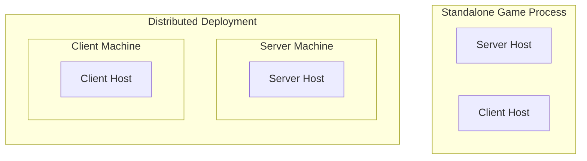

## 7. Host Composition

Hosts are logical execution contexts rather than operating system processes. An application may compose one or more hosts within a single executable.

Examples include:

- a dedicated server process containing a single server host
- a gameplay client process containing a single client host
- an editor process containing an editor host alongside one or more simulation hosts
- a standalone game containing both a server host and a gameplay client host within the same process

Whether hosts execute in separate processes, within the same process, or across multiple machines is an application deployment decision. Atlas places no architectural distinction between these deployment models.

### Composition Defines Behavior

The behavior of a host is determined by its composition. The process boundary does not define the architecture.

*Both represent the same architectural model. The difference is deployment location, not execution semantics.*

### Host Communication

Hosts communicate through the same generated public contracts regardless of where they execute. Communication may occur through:

- in-process calls
- local transport
- network transport
- test harness integration

The contract boundary remains identical.
