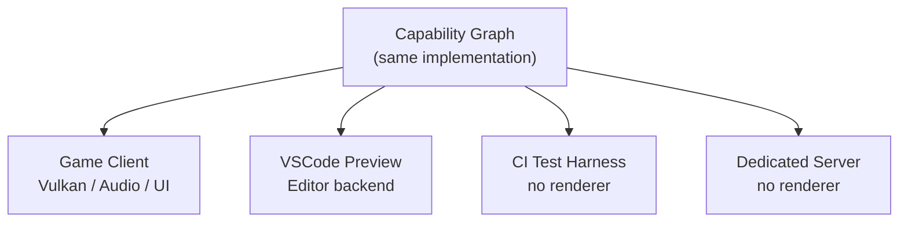
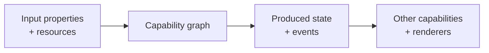

## 9. Capability Isolation and Previewing

Because every host is just a composition of capabilities against the same runtime (§8), any capability can be hosted and exercised in isolation — outside the full game, outside the editor, without a running server, without a player. A test harness is a host. A preview tool is a host. A CI job is a host. They differ from a game client only in which capabilities they compose and which backend they attach.



This is §8's "they are all host compositions" taken to its practical conclusion: **the runtime is a library, and the preview tool is just a different deployment of it.**

### Previewing Capabilities Without a Full Game

A capability that produces visual, audio, or physical output can be previewed by composing it into a minimal host with only the dependencies it actually needs — not the full game capability graph. A cloth simulation capability requires only the physics and mesh capabilities it depends on; it does not require networking, combat, or UI.

A cloth QA preview:

```yaml
host: ClothPreview
composes: [entity, physics_cloth, render_mesh, animation]

preview_state:
  Movement.Speed: 4.2
  Wind.Velocity: 20
  Animation: SwordOverheadAttack
```

This is not a "fake cloth viewer" — it is the actual `physics_cloth` capability running. The same code that runs in production runs here. Any bug visible in the preview is a real bug; any result confirmed in the preview is a real result.

The same pattern applies to:

- **Audio**: compose `audio_footstep` + `atlas-input` (mocked) + an audio backend; scrub surface type, footwear, and impact force as properties; hear the actual composed result in real time
- **Particles**: compose the particle capability against a minimal render host; set `Element: Fire`, `Intensity: 0.8`, `Wind: 10` as properties; observe the actual particle capability running
- **Animation**: set `Movement.Speed`, `Character.Haste`, `WeaponType`, `State` as preview properties; render the actual animation graph the game would use
- **Physics**: run a vehicle collision scenario against the actual physics capability; assert `max_penetration`, `max_velocity`, absence of NaN

### Property Scrubbing

Because everything is property-driven (§21, Property and Resource Composition), a preview host can expose its full property state to a UI — and changes to any property immediately re-resolve the capability graph, producing updated output. This makes continuous, interactive previewing a natural consequence of the architecture, not a special tooling feature:

```
ImpactForce
0 ─────────────────── 100
                   ^
                  75

→ volume scaling, pitch changes, additional audio layers, distortion, reverb
  all re-resolve in real time as the slider moves
```

The preview tool is not simulating the capability behavior. It is running it.

### Automated Capability Testing

The same host isolation that enables interactive previewing enables automated testing in CI. A test harness host composes only the capabilities under test, provides controlled inputs, and asserts against outputs — using the same determinism guarantees (§4) that make replay and resimulation possible:

```yaml
test: ClothStabilityTest
host: ClothPreview

scenarios:
  - animation: run
    duration: 30s
  - animation: jump
    duration: 10s
  - wind: 50kmh

assertions:
  max_penetration: 2mm
  max_velocity: 100m/s
  no_nan: true
```

Every asset build can detect unstable cloth, bad collision proxies, and exploding constraints before they reach players — against the actual runtime implementation, not a test approximation of it.

### The Common Pattern

Every Atlas subsystem follows the same pipeline shape:



Physics, audio, UI, animation, particles, clothing — all instances of the same pattern: input properties feed a capability graph, which produces state and events that other capabilities and renderer backends consume. This uniformity is what makes capability isolation previewing work across every domain without special-casing any of them.
