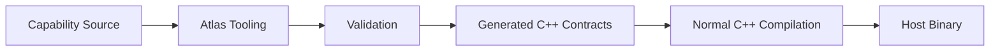

## 12. Build Model

The application owns the build. Atlas contributes tooling.

The build system invokes Atlas tooling before normal C++ compilation begins. Atlas tooling performs:

- capability validation
- contract generation
- reflection generation
- resource compilation
- documentation generation
- dependency validation

Generated code becomes ordinary C++ source. Generated artifacts participate in the normal application build pipeline.

### Compile-Time Validation

Atlas validates the application graph before execution. Validation includes:

- capability dependency graphs
- contract compatibility
- request signatures
- event definitions
- serialization schemas
- stage ordering
- resource references
- host composition rules

Invalid compositions fail during compilation rather than producing runtime discovery failures.

### Build Artifacts

A successful Atlas build produces:

- generated C++ contracts
- reflection metadata
- serialization metadata
- resource identifiers
- documentation metadata
- validated host configurations

These artifacts are consumed by normal runtime code. Atlas does not require a separate runtime compilation phase.
