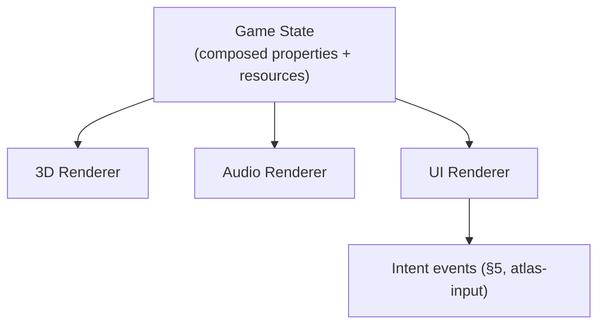
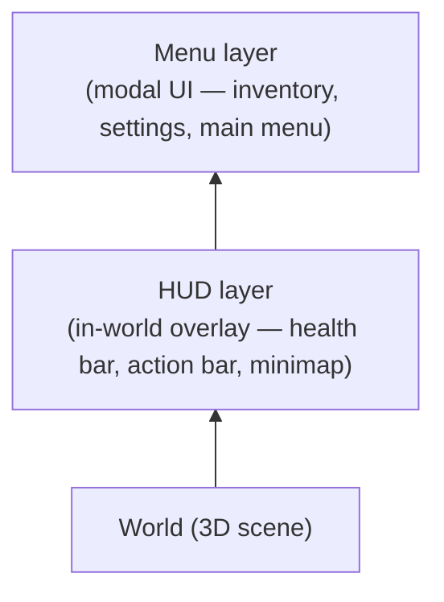
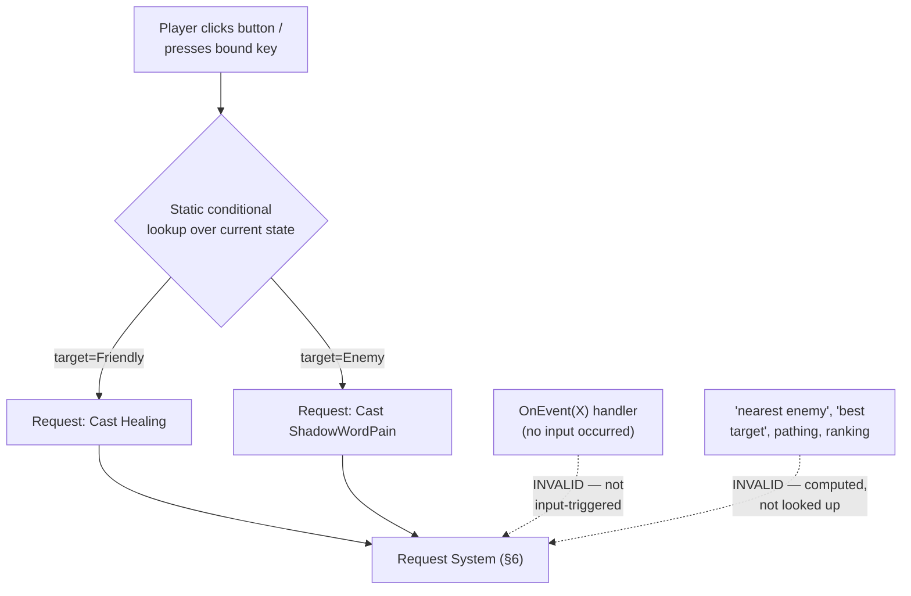

## 19. UI System

Atlas provides a UI system as a capability layer. It is not a UI framework in the traditional sense — it does not define `Button`, `Window`, or `Panel` as named widget types. It defines the **minimum contract** through which capabilities describe interfaces without knowing the final toolkit: a bindable property tree, resource references, input events, and composition. A backend (GPU-native, editor-native, or otherwise) renders that contract however it chooses. The game never sees the backend; the backend never sees the game.

This is the same pattern as the 3D and audio renderers: game state flows into a renderer, which produces output. The UI renderer is the third leg of that arrangement:



The UI renderer consumes properties, resources, and state. It produces `Intent` events — the same `Intent` events `atlas-input` produces from hardware input. A button click and a keypress are indistinguishable to the capabilities below them.

### Minimum UI Contract

Atlas does not define widget types. It defines **primitives** from which any widget can be composed, following the same capability composition philosophy applied everywhere else (§5, Tiny Interface Composability):

- **Node** — a positioned, sized element in the UI tree, with a transform and optional children
- **Bindable property** — any node property (`visible`, `color`, `text`, `value`) may be bound to a composed game property (§20), re-evaluated whenever that property's effective value changes (§20, Continuous Re-resolution)
- **Resource reference** — any node property may reference an external asset (`icon`, `background`, `font`) through ordinary resource identity (§3, Resource)
- **Behavior** — small, composable capabilities a node may carry (`Clickable`, `Focusable`, `Draggable`, `Tooltip`, `CooldownOverlay`)

A `Button` is not a built-in type. It is `Node + Text + Background + Clickable + Focusable`. An ability slot is:

```yaml
widget: AbilitySlot
behaviors: [Clickable, Tooltip, CooldownOverlay]

bind:
  icon:     resource: FireballIcon
  cooldown: property: FireballCooldown
  enabled:  property: CanCastFireball

on_click:
  intent: CastAbility
  params:
    ability: Fireball
```

No special "spell bar widget type." The capability that owns `AbilitySlot` composes existing behaviors onto a node and declares its bindings — same composition model as everything else.

### Compositing Layers

The UI renderer composites in three fixed macro-layers, always in this order:



Each macro-layer has its own internal Ordered Composition (§20) for widget stacking — tooltips, panels, overlays within a layer use exactly the same mechanism as `MaterialLayers` does for character skin layers, just producing draw calls rather than texture layers. A tooltip is an internal layer of whichever macro-layer spawned it; it never needs to jump macro-layers.

### Art Style vs. Player Styling

**Art style** is declared structure (§14, Declarative Boundary) — layout, decoration, color defaults, 9-slice borders. It is authored by the developer, compiled in, and not player-editable:

```yaml
style: PanelBackground
resource: panel_border_9slice.png
slicing: { left: 8, right: 8, top: 8, bottom: 8 }
```

**Player styling** is a Priority Override (§20) contribution over a developer-declared `player_overridable` allowlist. The developer explicitly opts individual properties into player override; everything else (layout, decoration) is structurally unreachable:

```yaml
widget: HealthBar
style:
  fill_color: "#c0392b"
  player_overridable: [fill_color]   # layout, decoration NOT listed — not overridable
```

A `player_ui_style` capability contributes override values at higher priority than the art-style base, for opted-in fields only. When and where to persist those values is a capability-logic concern (§20, Contribution Lifetime) — Atlas provides the serialization mechanism (`atlas-serialization`, §13), game logic decides what to save and when.

### UI Capability Packages

The core UI system provides only the primitive contract above — nodes, bindings, behaviors, compositing layers. Higher-level widget vocabularies (`Button`, `InventoryGrid`, `Timeline`, `Inspector`) are supplied as separate capability packages, following the same curated-capability-repository model described in §11. The Atlas team intends to provide a standard set of these packages; games may also compose their own.

### Backend Implementations

The UI renderer contract is backend-agnostic. Any renderer that can consume a node tree with resolved property values and resource references may serve as the UI backend:

- a GPU-native renderer (for game HUDs requiring high throughput and custom shaders)
- an editor-native toolkit (well-suited for authoring tools and inspectors)
- a web renderer
- a terminal renderer

The game never references the backend. Backend selection is a host composition and deployment concern, not a capability concern.

### Architectural Placement

The UI system is delivered as one or more ordinary capabilities (§3, Capability), following the same rules as any other:

- composed at compile time (§4, Compile-Time Composition)
- depends only on lower-level capabilities and runtime libraries (§5, Dependency Model)
- exposes its surface through generated contracts (§14, Generated Contracts)
- a game that does not compose it pays no cost for its existence (§16, Capability Independence)

### WotLK Addon Compatibility

WotLK addon compatibility is an **optional, separately-composable capability** built on top of the native UI system above. It is not the UI framework itself — it is a Lua API layer that exposes the native UI contract through the familiar WotLK `CreateFrame`/`RegisterEvent`/`OnEvent` surface, so that existing third-party addons can build UI against it.

Under the hood, `CreateFrame` constructs the same native node primitives the declarative YAML generates — meaning addon-built UI and developer-built UI render through one underlying system, through different front doors. The §19 Request Boundary rules apply uniformly regardless of which door was used.

Introducing Lua does not introduce a second execution model. The Lua runtime is embedded and driven by ordinary Atlas systems the same way any other capability's logic is driven. Lua scripts do not bypass the request/event contract boundary to reach into simulation state directly.

### Request Boundary

Lua and addons may build UI freely — creating frames, buttons, action bars, and wiring them to send requests, following ordinary WotLK addon authoring (§19, Addon Compatibility Layer). The boundary is not "Lua cannot issue requests." It is narrower and more specific, and mirrors the real distinction WotLK-era addon policy already draws between ordinary macros/UI and disallowed automation:

**A Lua-issued request is valid only if both of the following hold:**

1. **It is triggered synchronously by a real, discrete input action** — the player clicking a button or pressing a bound key, in that same instant. It is never triggered by an event callback, a timer, or any other code path that runs without a corresponding input action occurring right then.
2. **The logic between the input and the request is a static conditional lookup over currently-visible state** — selecting among a small, author-declared set of possible requests based on simple conditions (target type, buff presence, current form) — never a computed decision (best target, nearest enemy, optimal rotation), never a search, and never anything that reasons about the game state to produce a choice rather than merely look one up.



**Valid**, because it is triggered by a real click and only looks up a fixed choice from currently-visible state:

```lua
-- One button, one click, choosing between two fixed, pre-declared requests
-- based on the current target's disposition. No computation, no search.
local function OnButtonClick()
    if UnitIsFriend("player", "target") then
        Atlas.CastRequest("Healing")
    elseif UnitIsEnemy("player", "target") then
        Atlas.CastRequest("ShadowWordPain")
    end
end
```

**Invalid**, because nothing was clicked — the request is triggered by an incoming signal, and it is Lua deciding to act, not the player:

```lua
-- INVALID: reacts to an event, not an input action.
-- This is the addon acting on the player's behalf, not for them.
f:RegisterEvent("UNIT_TARGETING_ME")
f:SetScript("OnEvent", function(self, event, sender)
    Atlas.CastRequest("Retaliate", target = sender)  -- rejected
end)
```

**Invalid**, because "nearest" and "best" are computed decisions, not a lookup among fixed pre-declared options:

```lua
-- INVALID: computes a target/choice rather than looking one up
-- among options the player already specified.
local function OnButtonClick()
    local target = FindNearestEnemy()          -- computation — not allowed
    local spell  = ChooseBestSpellFor(target)   -- computation — not allowed
    Atlas.CastRequest(spell, target = target)
end
```

This is the same shape as WotLK's own secure macro/action-button model: conditionals like `[target=Friendly]` are allowed because they resolve instantaneously against state visible at the moment of a real click; anything that runs independently of a click, or that searches/ranks/paths rather than looks up a fixed choice, is not. Atlas enforces this at the request boundary rather than relying on convention: the compatibility layer (§19, Addon Compatibility Layer) only exposes a request-issuing API shaped as a synchronous, input-bound conditional dispatcher — there is no API surface through which an event handler or a computed value can reach the Request System at all, so the invalid patterns above are not merely discouraged, they have no function capable of expressing them.

Outside of issuing requests through that narrow, input-bound path, Lua and addons remain strictly presentation-side and read-only with respect to simulation state — this is not a convention, it is an architectural boundary the same way audio and rendering are excluded from the deterministic boundary (§4, Deterministic Execution):

- Lua scripts and addons **read** replicated/observable state through the same contracts any client capability would use (§6, Server Authority — "client hosts observe replicated state"), and may freely build UI, display logic, and event-driven *presentation* (updating a health bar display, playing a sound, flashing a warning) in response to any event — the input-triggering restriction above applies only to issuing requests, not to observing and displaying state.
- Lua scripts and addons never read or write simulation state directly, never participate in deterministic scheduling, and are not part of the bit-exact replay boundary (§4). A replay reproduces simulation outcome; it does not require the UI layer to run identically, the same way it does not require rendering to run identically.
- Because addons sit outside the deterministic boundary, non-deterministic behavior in Lua (which is expected, given real-world addon code) has no effect on simulation correctness, cross-machine reproducibility, or replay validity.

This keeps the addition consistent with the rest of the platform: Atlas adds a new *capability*, not a new kind of runtime guarantee. The mechanism that matters — determinism, authority — remains untouched; what's added is a narrowly-shaped, input-bound path by which presentation-side Lua code can still participate in issuing ordinary, validated requests, without that path being usable to automate gameplay decisions on the player's behalf.

### Addon Compatibility Layer

A dedicated capability provides a compatibility layer targeting the WotLK (3.3.5) addon API surface, so existing unmodified addons can run against Atlas games that compose it.

This includes, at minimum:

- the FrameXML-era frame object model (`CreateFrame`, frame inheritance/templates, anchors and regions)
- the standard event-registration model (`RegisterEvent`, `OnEvent` handlers) mapped onto Atlas's own event delivery (§15, Runtime Responsibilities) for the events an addon expects to exist
- the Lua global API surface addons commonly depend on (string/table utilities, `SavedVariables`-style persistence, slash commands)
- XML-defined UI templates, to the extent addons rely on declarative frame layout rather than pure Lua construction

Compatibility is targeted at **existing, unmodified addons** as the goal, not merely an API "inspired by" the WotLK style. Where full fidelity isn't achievable (e.g. APIs that assumed WoW-specific game rules Atlas has no equivalent concept of — §2, Mechanism Over Meaning), that gap is a property of this specific compatibility capability, not a compromise to the rest of the platform: an addon calling into WoW-specific game logic is asking a *game rules* question, and Atlas capabilities providing that compatibility layer must supply their own equivalent concept, the same way any capability defines its own semantics.

### What Games Gain

- A game may compose the Lua UI capability alone, to get a scripted UI framework without addon compatibility.
- A game may additionally compose the WotLK compatibility capability, to allow existing third-party addons to run against the game's own UI state, so long as the game exposes the events and data those addons expect (which is the game's responsibility to provide via its own capabilities, not Atlas's).
- A game that composes neither is unaffected — the framework and compatibility layer are both optional capabilities, consistent with §16 (Capability Independence).

### Worked Example: Exposing an Event to an Addon

This example extends the `health` capability from §21 (Worked Example) to show how a game bridges its own gameplay event to the Lua UI layer, so that a WotLK-style addon can consume it — without `health` itself knowing that Lua, UI, or addons exist.

```mermaid
flowchart LR
    Health["health capability<br/>(§21 — unmodified)"] -->|"publishes HealthChanged"| Bridge["health-ui-bridge capability"]
    Bridge -->|"fires UNIT_HEALTH"| LuaFramework["Lua UI Framework"]
    LuaFramework -->|"OnEvent(\"UNIT_HEALTH\")"| Addon["Third-Party Addon<br/>(unmodified WotLK Lua)"]
```

**`health` stays exactly as defined in §21.** It publishes `HealthChanged` as an ordinary contract event. It has no dependency on, or awareness of, any UI or Lua capability — consistent with §5 (capabilities may depend only on lower-level capabilities, and `health` is lower-level than any UI concern).

**A new capability, `health-ui-bridge`, depends on both `health` and the Lua UI framework capability**, and translates between them. The dependency itself is declared the same way `health` was — as data (§14, Declarative Source Format). This example is abbreviated (§13, Capability Manifest) to just the fields it needs; a real manifest also carries `source` and `contracts`:

```yaml
capability:
  name: health_ui_bridge
depends_on: [health, lua_ui]
```

Only the translation logic is hand-written C++, since it's behavior, not structure:

```cpp
// health_ui_bridge.cpp — hand-written, not generated

void on_event(atlas::Context& ctx, const health::HealthChanged& evt)
{
    ctx.lua().fire_event("UNIT_HEALTH", evt.target, evt.new_current);
}
```

This is ordinary manual implementation (§14, Manual Implementation), not a runtime mechanism. `health-ui-bridge` is the only place that knows both "what `HealthChanged` means" and "what event name an addon expects" — `health` and `lua-ui-framework` remain mutually unaware of each other, each reusable independently (§4, Capability Isolation).

**The addon itself is unmodified WotLK-style Lua**, registering for the event through the compatibility layer's `OnEvent` model (§19, Addon Compatibility Layer):

```lua
local f = CreateFrame("Frame")
f:RegisterEvent("UNIT_HEALTH")
f:SetScript("OnEvent", function(self, event, unit, current)
    if unit == "player" then
        HealthBarFrame:SetValue(current)
    end
end)
```

Nothing about this addon changes based on whether it's running in the original game the API was designed for or in an Atlas game composing `health-ui-bridge` — which is the point of the compatibility layer.

**Composing the host** (§14, Declarative Source Format):

```yaml
host: GameplayClient
composes:
  - entity
  - health
  - health_ui_bridge
  - lua_ui
  - wotlk_addon_compat
  - replication
  - networking_client
```

What this illustrates:

- The presentation-only boundary (§19, Request Boundary) holds end to end: the addon only ever observes replicated state via `UNIT_HEALTH`, and never touches `Health` or `ApplyDamage` directly.
- A single small bridge capability is sufficient to connect an existing, unmodified gameplay capability to an existing, unmodified addon — neither side is aware of the other, consistent with §2 (Mechanism Over Meaning): `health-ui-bridge` is where "meaning" (health maps to `UNIT_HEALTH`) is decided, not `health` and not Atlas.
- A game that doesn't want addon support simply omits `health-ui-bridge`, `lua-ui-framework`, and `wotlk-addon-compatibility` from its host composition; `health` is unaffected either way (§16, Capability Independence).
