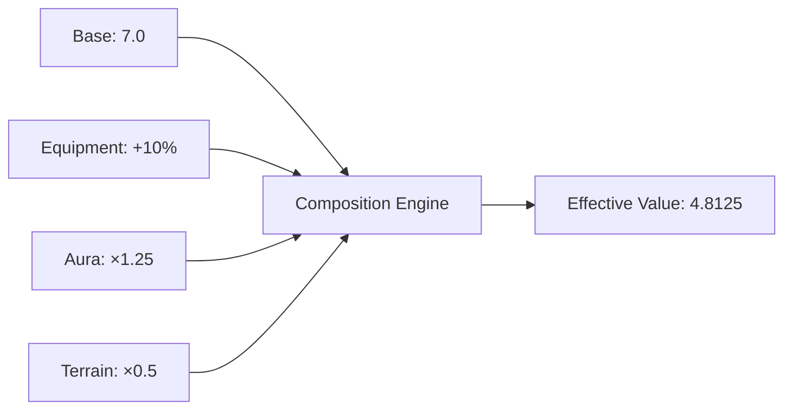
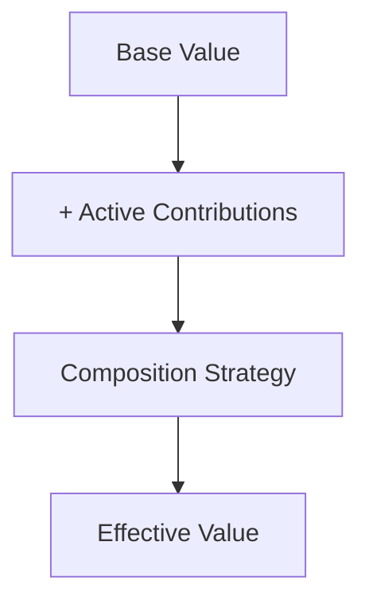
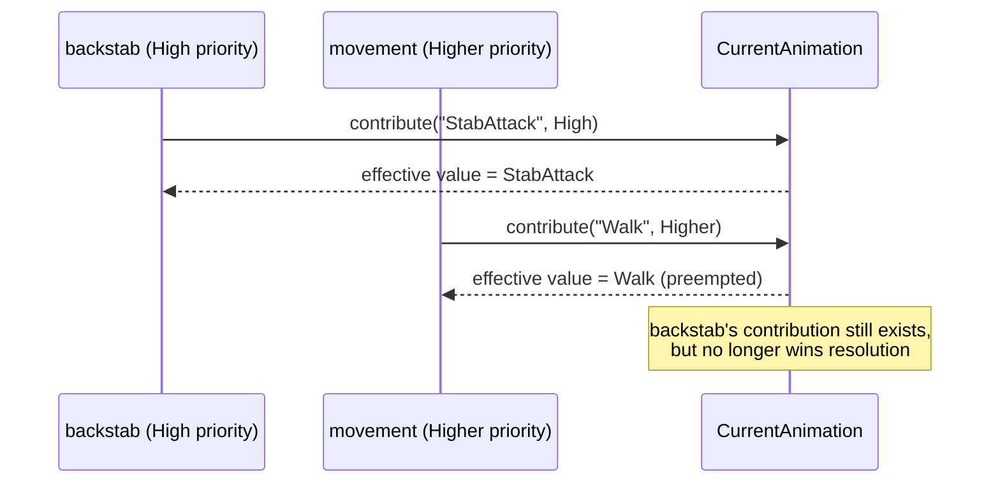
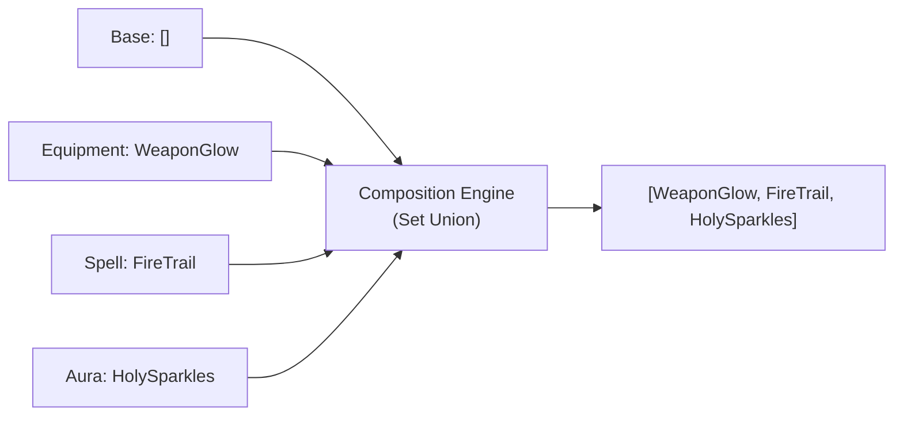
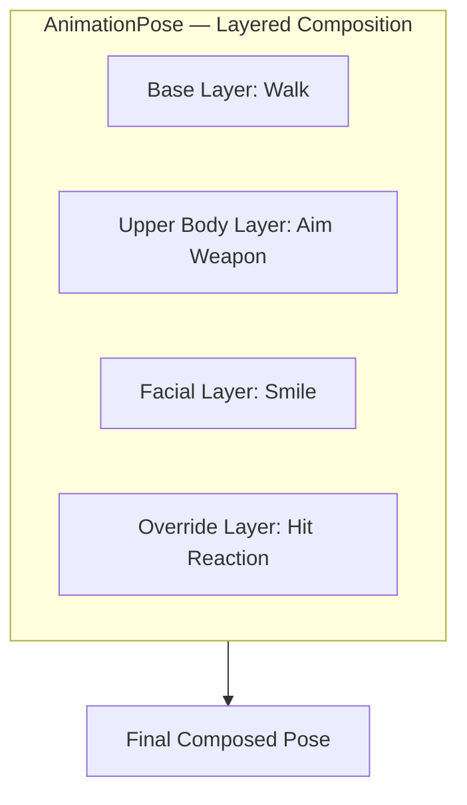
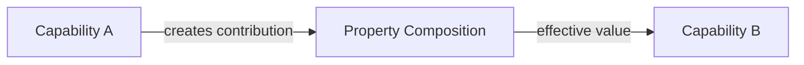

## 20. Property and Resource Composition

Property Composition is the mechanism by which multiple, mutually unaware capabilities contribute to a single effective value. It generalizes the tiny-interface principle from §5: where §5 defines how a capability depends on a narrow slice of structure, this section defines how several capabilities independently *contribute to* that structure without depending on each other.

The mechanism is domain-agnostic. The same composition model applies to:

- gameplay values (movement speed, armor, damage)
- animation and pose selection
- particle and visual effects
- skeleton and skin layering
- material layering
- audio sources
- UI state
- AI parameters
- configuration overrides

Property Composition does not define meaning. It defines **how** independent contributions combine into a value — not what that value represents. This is Mechanism Over Meaning (§2) applied to composition itself: Atlas knows how to combine contributions; it does not know what an "aura" or a "weapon glow" is.

### Design Goals

**Independent contributions.** Multiple capabilities affect the same property without knowing about each other. An equipment capability, an aura capability, and a terrain capability can each contribute to `MovementSpeed` with no dependency between them:



*The movement capability that reads the effective value has no dependency on the equipment, aura, or terrain capabilities that contributed to it.*

**No domain knowledge.** The composition system knows only:

```
Property + Contributions + Composition Strategy = Effective Value
```

It has no knowledge of spells, weapons, characters, animations, particles, or materials — the same boundary already drawn in §2 (Mechanism Over Meaning).

**Properties and resources share one model.** A property may hold a numeric value, state, a reference, a resource, a collection, or structured data. The same composition mechanism applies regardless. `Health`, `MovementSpeed`, `CurrentAnimation`, `ParticleEffects`, `MaterialLayers`, and `ActiveAudioSources` are all, structurally, properties composed the same way.

### Terminology

| Term | Meaning |
|---|---|
| **Property** | A named value associated with an entity (e.g. `MovementSpeed: float`) |
| **Resource** | An external asset referenced by a property (e.g. an `AnimationResource`). Resources are values — they compose like any other property. |
| **Contribution** | An independent input to a property: a source, a value, a priority, metadata, and a lifetime |
| **Effective Value** | The result of combining the base value with all active contributions through the property's composition strategy |

A property's definition specifies its type, its composition strategy, its default/base value, and its validation rules — it does not enumerate every possible contribution up front. Like any other capability structure, it is authored declaratively (§14, Declarative Source Format):

```yaml
property: MovementSpeed
type: float
composition: Multiply
base: 7.0
```

Tooling generates the corresponding constexpr contract:

```cpp
// GENERATED — movement_speed.property.hpp

struct MovementSpeed {
    static constexpr auto composition = atlas::Composition::Multiply;

    float base = 7.0f;
};
static_assert(atlas::PropertyContract<MovementSpeed>);
static_assert(atlas::Composable<MovementSpeed>);
```

### Composition Pipeline

Every property resolves through the same pipeline:



### Continuous Re-resolution and Preemption

The pipeline above is not computed once when a contribution is added. It re-resolves whenever the active contribution set for a property changes — a contribution is added, a contribution is removed, or a contribution's lifetime (§20, Contribution Lifetime) expires.

This matters most for strategies like **Priority Override**, where the effective value is a single winner among several candidates. When a new contribution is added with a higher priority than the current winner, it preempts immediately — the property's effective value changes on the same tick the new contribution is registered, without the losing contribution needing to be explicitly withdrawn first.



A preempted contribution is not deleted — it remains registered, with its own lifetime, and may win resolution again later if the contribution that preempted it is removed first. Whether that's the right behavior for a given property is a modeling decision made when the property declares its composition strategy and the priorities its contributors use, not a runtime policy Atlas imposes.

**No cross-capability coupling is required for preemption to work.** A capability contributing at a given priority does not need to know what, if anything, it might preempt or be preempted by — it only declares its own contribution and priority. This is what keeps §4 (Capability Isolation) intact under interruption: `movement` contributing `CurrentAnimation` at a higher priority than an in-progress attack's animation is sufficient to end the attack's visible presentation, without `movement` referencing `backstab`, or `backstab` referencing `movement`, at all. The correct outcome falls out of declared priorities, not negotiated coupling between capabilities.

This is also why presentation state can never be "locked": nothing about the composition model gives a contribution the ability to block a higher-priority one from taking over. A capability that wants an attack to be uninterruptible for a period does so by contributing at a high enough priority for that period — not by any mechanism that prevents other contributions from being registered.

### Continuous vs. Triggered Composition

Everything described above assumes a property is a **standing** composition: contributions are added and removed independently, each carries its own lifetime (§20, Contribution Lifetime), and an effective value exists continuously between resolutions, re-resolving whenever the active set changes. `MovementSpeed`, `ActiveAudioSources`, and `MaterialLayers` are all standing properties in this sense — there is always a current effective value, whether or not anything just changed.

Not every composition fits this shape. Some outputs are meaningful only at the moment of a specific, discrete event — a footstep occurring, an impact happening — and have no standing effective value between occurrences. For these, contributions are registered by, and scoped to, a single event occurrence: multiple capabilities independently contribute in response to the same event, the composition strategy resolves once against that event's contributions, and the result is consumed immediately rather than persisted as an ongoing property value.

This is **the same mechanism** — contributions, a composition strategy, the composition engine — used with a different resolution lifecycle, not a second system. A **triggered** composition differs from a **continuous** one only in when resolution happens and whether a result persists afterward:

| | Continuous | Triggered |
|---|---|---|
| Contributions | Added/removed independently, with lifetimes | Registered in response to a single event occurrence |
| Resolution | Re-resolves whenever the active set changes | Resolves once, at the moment of the triggering event |
| Effective value | Exists continuously between resolutions | Exists only for that occurrence; discarded after |
| Example | `MovementSpeed`, `ActiveAudioSources` | A footstep's layered sound (surface + footwear) |

A property declares which mode it uses as part of its definition, alongside its composition strategy — the distinction is a property of the property, not a judgment call made at each contribution site.

**Triggered composition has no separate delivery mechanism.** A triggered property's occurrence is not pushed to interested capabilities through a callback or subscriber list — it is a same-tick write to that property's value, read the same way any other consumed property is read (§5, Property-Level Ordering), during the reading capability's own scheduled turn in the tick's Transform phase (§4, Tick Execution). A triggered property that did not occur this tick holds a null/absent sentinel value, by convention, rather than being unset or undefined; "did this event happen this tick" is an ordinary null check against a consumed value, not a distinct event-handling code path. This is what makes triggered composition schedulable and parallelizable the same way continuous composition already is — a consumer node becomes ready once its consumed triggered property has reached this tick's value (occurred or not), exactly like any other dependency edge, with no callback whose execution order the scheduler cannot see into.

Not every derived output needs to be a composed property at all. Where a result depends on gathering a few inputs and applying ordinary selection logic — for example, choosing a collision impact sound from an entity's armor material and impact velocity — those inputs may themselves come from composed properties, but producing the final result is manual implementation (§14, Manual Implementation), not a composition strategy. Composition combines independent contributions; it is not the only mechanism through which capabilities derive presentation output from state.

### Composition Strategies

The composition strategy is part of a property's compile-time contract (§5, Tiny Interface Composability) — it is fixed when the property is declared, the same as any other structural contract. **Which contributions are active at a given moment is runtime state**, changed by ordinary game logic (an aura applying, a buff expiring). The strategy defines what composition *can* be expressed; game logic decides what *is* expressed, and when.

| Strategy | Use | Example |
|---|---|---|
| **Additive** | Values that accumulate | Armor: `100 + 50 (plate) + 20 (buff) = 170` |
| **Multiplicative** | Scaling factors | MovementSpeed: `10 × 0.5 (slow) × 1.2 (haste) = 6` |
| **Override** | One source replaces another | CurrentAnimation: `Idle` → `Attack` (combat state overrides) |
| **Priority Override** | Highest-priority candidate wins among several | AnimationState: `Stunned > Weapon > Default` |
| **Set Union** | Collections merge | Tags: `[HeavyArmor] ∪ [Blessed] = [HeavyArmor, Blessed]` |
| **Ordered Composition** | Order of contribution matters | MaterialLayers: `Skin → Tattoo → Armor → DamageOverlay` |
| **Weighted Composition** | Contributions blend proportionally | AnimationPose: `70% Walk, 30% Run` |

New composition strategies are added as capabilities, following the same extension model as any other capability (§4, §5) — the runtime core provides registration, evaluation, storage, and reflection; capabilities provide the specific strategies (Add, Blend, Priority, and domain-specific variants).

### Resource Composition

Resources compose exactly like properties. A resource-typed property (e.g. `ParticleEffects: ResourceList`) accumulates contributions from independent capabilities the same way a numeric property does:



The consumer (e.g. a renderer) reads only the effective resource list. It has no dependency on which capability contributed which entry.

### Animation, Skeleton, and Material Composition

Animation, skinning, and materials are not special-cased mechanisms — they are ordinary resource properties composed with the strategies above.

- **Animation selection** typically uses **Priority Override**: a `Stunned` contribution outranks `Combat`, which outranks `Movement`, which outranks the `Idle` base.
- **Animation blending** (a walk/run blend, an upper-body aim layer, a facial expression layer) uses **Weighted Composition** or **layered** composition, where each layer resolves independently and layers combine in a defined order.
- **Skeleton composition** uses **Ordered Composition**: a base `HumanoidSkeleton` extended with an `ArmorSkeletonExtension` contributing additional bones.
- **Skin and material composition** uses **Ordered Composition**: a base texture layered with tattoo, armor, damage-overlay, wetness, or glow contributions, each capability-owned and mutually unaware of the others.



No animation-specific or material-specific mechanism exists in the runtime. A capability author reaches for the same composition strategies whether contributing gameplay state or visual state — consistent with §1's assertion that Atlas provides mechanisms, and applications provide meaning.

### Audio Composition

Audio uses the identical mechanism: an `ActiveAudioSources` property accumulates contributions (environment, equipment, ability effects) into a mixed audio graph, the same way `ParticleEffects` accumulates into a render list.

### Contribution Lifetime

A contribution carries an explicit lifetime, independent of the composition strategy:

- **Permanent** — remains until explicitly removed
- **Duration** — expires after a fixed time
- **Until Event** — removed when a specified event occurs
- **While Condition Exists** — tied to an external condition (e.g. an aura remains only while its source entity is alive)

Lifetime is evaluated using Atlas's deterministic time (§4, Built-in Deterministic Types) when the property participates in simulation, keeping duration-based contributions reproducible under replay the same as any other simulation state.

### Request Validation and Presentation-Only Properties

Whether a property's *type* is subject to Request Validation (§6) depends on what it represents:

- **Gameplay-affecting properties** (e.g. `MovementSpeed`, `Health`, `Armor`) are mutated through ordinary requests, validated and subject to rejection exactly as described in §6. An aura contributing `MovementSpeed ×0.5` is, mechanically, a request like any other — it can be rejected if the issuing source lacks authority or the contribution is invalid.
- **Presentation-only properties** (e.g. `CurrentAnimation`, `ParticleEffects`, `MaterialLayers`, camera effects) are not simulation state, and follow the same presentation-only boundary already defined for the Lua UI layer (§19, Request Boundary) and for rendering/audio (§4, Deterministic Execution): the property itself is never rejected, and has no effect on authoritative state or replay correctness.

This split is a property of the property's own contract — declared once, when the property is defined — not a judgment call made at each contribution site.

**Presentation-only does not mean unconditional.** A contribution to a presentation-only property is commonly the *consequence* of a request outcome rather than an input to one — and where that's the case, the contribution must be made only after the triggering request has been validated and accepted, never speculatively in advance of that outcome. A capability must not contribute presentation state on the strength of a request it has only issued, not yet had confirmed — doing so presents an outcome to the player that the server may still reject.

Concretely: a client issuing a request does not contribute to `CurrentAnimation` or `ParticleEffects` locally in anticipation of that request succeeding. The contribution is made once, by whichever host is authoritative for the decision the presentation depends on, as part of that request's accepted handling — and reaches other hosts through ordinary replication, the same as any other effect of a validated request. This is a stricter reading of §6 (Server Authority) than "presentation is exempt from validation": presentation is exempt from being *itself* rejectable, but it is not exempt from depending on a decision that was validated.

### Below Presentation-Only: State Atlas Does Not Model At All

Not every piece of UI-adjacent state is even a presentation-only property. Continuous, high-frequency interaction feedback — a widget tracking a live mouse drag, a slider's handle following the pointer before release, a map tool previewing a course leg as the cursor moves — is not represented in Atlas's property model at all, not even as a presentation-only property (above). It is local UI-layer state, owned and mutated entirely outside any capability, with no property contract, no composition strategy, and no tick involvement.

Only the *commit* of that interaction — a mouse-up, an explicit confirm, a typed value entering a field — becomes a Request, validated and applied at the next tick boundary like any other (§4, Tick Execution; §6, Request Validation and Reconciliation). This is what allows an interactive tool to feel immediate despite the platform's fixed per-tick request delay (§6): the delay applies to state Atlas is responsible for keeping correct and replayable, not to transient feedback a widget shows a single user before that user has decided anything. A capability author never sees the in-progress drag; it only ever sees the request the drag eventually produced, once produced.

### Runtime Representation

A contribution and its resolved output are ordinary, reflected data structures:

```cpp
// property_composition.hpp

template <atlas::Composable P>
struct PropertyContribution {
    atlas::PropertyId<P> property;
    atlas::SourceId      source;
    typename P::ValueType value;
    atlas::Priority       priority;
    atlas::Lifetime        lifetime;
};

template <atlas::Composable P>
struct EffectiveProperty {
    atlas::PropertyId<P> id;
    typename P::ValueType value;
};

// Reading an effective value uses the same typed, monadic context
// API as any other property access (§20, and see §21's ctx.get<T>()):
//
//   ctx.get<MovementSpeed>(entity)
//      .as_float()
//      .or_else([] { return MovementSpeed::default_value(); });
```

### Networking and Replication

A tick's output (§4, Tick Execution) may reach more than one kind of consumer: replication to other hosts, a local presentation/render layer invalidating what it draws, or an input log a replay or undo/redo feature reads back later (§4, Replay and Reproducibility). These are three consumers of the same tick output, not three separate mechanisms — a single-user editor host with no other observer simply has no replication consumer for a given tick, the same way a headless server has no presentation consumer.

Property replication follows one categorical rule based on which capability produced the property:

**UI capability properties are never replicated.** A property declared by any UI capability (`atlas-ui`, `player_ui_layout`, or any capability in the game's own `ui/` layer) exists only on the client host that composes it. It has no server-side concept — not because the server ignores it, but because the server never composes the capability that declares it, so the property simply does not exist in the server's composition. UI layout, panel positions, action bar assignments, color overrides, and widget state are all client-local by definition.

**All other properties may be replicated.** Whether a non-UI property is replicated, and how, is declared per property. Two replication strategies are available:

| Strategy | Use case |
|---|---|
| **Replicate contributions** | Clients need to reproduce the composed result themselves (e.g. for client-side prediction, §6) |
| **Replicate effective value** | Simple presentation state where only the final result matters (e.g. `CurrentAnimation = Attack01`) |

The replication strategy is part of the property's definition, following the same "the property declares its own rules" pattern as composition strategy and request-validation applicability above.

The categorical UI boundary also resolves resource loading: UI resource IDs (icons, textures, fonts) are only ever resolved by client hosts, since only client hosts compose the UI capabilities that reference them. Server hosts never encounter UI resource IDs — not by filtering them out, but because the capabilities that reference them are simply absent from the server's composition (§3, Resource).

### Tooling Support

Because contributions and composition strategies are reflected (§14, Generated Contracts), tooling can display a property's full derivation without any property-specific tooling code:

```
MovementSpeed
  Base:          7
  Boots:         +10%
  Mud:           ×0.5
  Slow:          ×0.7
  Final:         2.695

Current Effects (ParticleEffects)
  Sources: Fire Aura, Weapon Glow, Zone Effect
```

This is generic across every composed property — an editor or debugger built against the composition contract works for `MovementSpeed`, `CurrentAnimation`, or any future composed property without modification, consistent with §18 (Editor Extensions: generic editing through reflection).

### Design Rule

A capability must not directly modify another capability's state. Contribution is the only channel:



Capability A contributes; it never reaches into Capability B's state directly. Capability B consumes the effective value; it never needs to know who contributed to it. This is the same isolation principle already established in §4 (Capability Isolation) and §5 (Tiny Interface Composability), applied to the specific case of multiple capabilities converging on one value.
