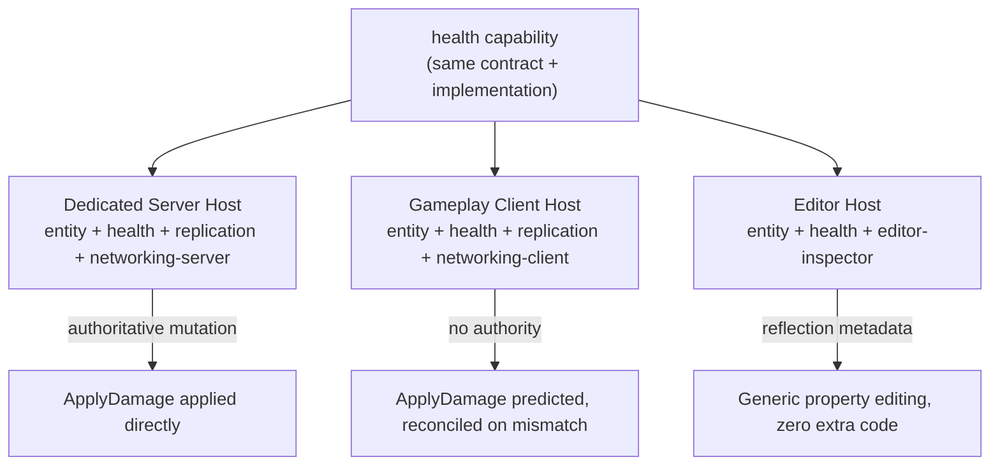

## 21. Worked Example

This section walks through a minimal capability and its composition into a host, to make the preceding architectural definitions concrete.

The example defines a single capability, `health`, with one entity property, one request, and one event. It is then composed into a server host and a client host to show how the same capability behaves under each host's authority model.

> **Note on scope:** this example is illustrative pseudocode, not a literal Atlas API surface. It is meant to show how the concepts in §1–§18 compose in practice, not to prescribe exact declaration syntax.

### Defining the Capability

A capability's structure — properties, requests, events, and dependencies — is authored declaratively (§14, Declarative Source Format), not hand-written as C++. Like `health-ui-bridge` in §19, this example is abbreviated (§13, Capability Manifest) to the structural fields; a real manifest also carries `version`, `source`, and `contracts`:

```yaml
capability:
  name: health
depends_on: [entity]

properties:
  Health:
    current: int32
    maximum: int32

requests:
  ApplyDamage:
    target: EntityRef
    amount: int32

events:
  HealthChanged:
    target: EntityRef
    new_current: int32
```

This is pure structure — no logic, per the Declarative Boundary (§14). Atlas tooling validates it (request signature, property types, dependency on the entity capability already existing at a lower level — §5) and **generates** the corresponding C++ contract:

```cpp
// GENERATED — health.capability.hpp
// Source: health.capability.yaml — do not hand-edit.

namespace atlas::health {

struct Health {
    std::int32_t current;
    std::int32_t maximum;
};
static_assert(atlas::PropertyContract<Health>);

struct ApplyDamage {
    atlas::EntityRef target;
    std::int32_t     amount;
};
static_assert(atlas::RequestContract<ApplyDamage>);

struct HealthChanged {
    atlas::EntityRef target;
    std::int32_t     new_current;
};
static_assert(atlas::EventContract<HealthChanged>);

static_assert(atlas::DependsOn<atlas::capabilities::entity>);

}  // namespace atlas::health
```

The generated contract provides a typed accessor for the `Health` property, a typed dispatch signature for `ApplyDamage`, and a typed publish/subscribe signature for `HealthChanged`. No algorithm lives in the generated contract — only structure (§14).

### Implementing Behavior

The capability author writes the manual implementation the contract describes (§14, Manual Implementation) — this part is always hand-written C++, never declarative, because it is behavior. It uses the typed context API — `ctx.get<T>()` returns a monadic result rather than a raw pointer or a throwing accessor, so absence and authority are handled explicitly rather than by convention:

```cpp
// health.cpp — hand-written, not generated

atlas::RequestResult on_request(atlas::Context& ctx, const ApplyDamage& cmd)
{
    // Request Validation (§6): reject if the request is invalid
    // for current authoritative state.
    if (!ctx.host().has_authority()) {
        return atlas::reject(cmd, "not authoritative");
    }

    return ctx.get<Health>(cmd.target)
        .or_else([&] { return atlas::reject(cmd, "target has no Health"); })
        .and_then([&](Health& health) -> atlas::RequestResult {
            health.current = std::clamp(health.current - cmd.amount,
                                         0, health.maximum);

            ctx.publish<HealthChanged>({
                .target      = cmd.target,
                .new_current = health.current,
            });

            return atlas::accept(cmd);
        });
}
```

This logic is ordinary application code. Atlas never inspects what "damage" or "health" mean (§2, Mechanism Over Meaning) — it only provides the deterministic mechanisms (property storage, request dispatch, event delivery) that let this code run identically wherever it is composed.

### Composing Hosts

Host composition is declared the same way as capability structure (§14, Declarative Source Format) — data, not hand-written C++:

```yaml
host: DedicatedServer
composes: [entity, health, replication, networking_server]
---
host: GameplayClient
composes: [entity, health, replication, networking_client]
---
host: Editor
composes: [entity, health, editor_inspector]
```



**Server host** — a dedicated server host links `health` alongside the capabilities that give it authority and network exposure. `ApplyDamage` requests arrive from connected clients over `networking-server`, are routed to `health`'s request handler, validated, and — if accepted — mutate authoritative `Health` state and publish `HealthChanged`, which `replication` then distributes to observing clients (§6, Server Authority).

**Client host** — a gameplay client host links the same `health` capability, without authority. The client's `health` capability is the same generated contract and the same manual implementation. The only difference is host composition: the client host does not compose an authority-granting capability, so `host.hasAuthority()` is false, and any locally-issued `ApplyDamage` is either not attempted or is treated as a local prediction pending server confirmation (§6, Request Validation and Reconciliation) — reconciled if the server later rejects it or produces a different `HealthChanged` outcome.

**Editor host** — an editor host composing `health` gains generic property editing for `Health` automatically, through generated reflection metadata (§18): no editor-specific code is required unless the capability author chooses to add a custom inspector.

### What This Illustrates

- The same capability (`health`) is compiled once and linked into three different hosts without modification (§4, Capability Isolation).
- Authority (§6) is a property of the host composition, not of the capability: the identical `ApplyDamage` handler behaves as authoritative mutation on the server and as prediction-pending-confirmation on the client.
- The contract (typed `Health`, `ApplyDamage`, `HealthChanged`) is the stable boundary every host composition depends on; only the manual implementation and the composing host differ.
- Reflection (§18) means the editor host required zero additional code to gain basic editing of `Health` — generic editing came from the contract alone.
