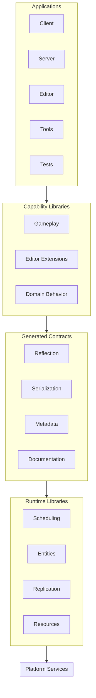

## 23. Platform Architecture

Atlas is organized as a layered platform.

```mermaid
flowchart TD
    subgraph L1["Applications"]
        A1["Client"]
        A2["Server"]
        A3["Editor"]
        A4["Tools"]
        A5["Tests"]
    end
    subgraph L2["Capability Libraries"]
        B1["Gameplay"]
        B2["Editor Extensions"]
        B3["Domain Behavior"]
    end
    subgraph L3["Generated Contracts"]
        C1["Reflection"]
        C2["Serialization"]
        C3["Metadata"]
        C4["Documentation"]
    end
    subgraph L4["Runtime Libraries"]
        D1["Scheduling"]
        D2["Entities"]
        D3["Replication"]
        D4["Resources"]
    end
    subgraph L5["Platform Services"]
    end

    L1 --> L2 --> L3 --> L4 --> L5
```

Every Atlas application is created by composing these layers. Only the application layer defines domain meaning.
